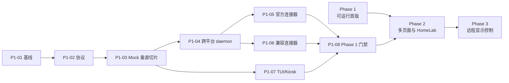

# HomePi Monitor 开发计划

```yaml
plan_id: PLAN-001
status: ready-for-review
source_of_truth: .vibe
product: HomePi Monitor
phase_order: [phase-1, phase-2, phase-3]
phase_1_node_count: 1
phase_1_auth_lifecycle: official-cli-only
history_storage: disabled
```

## 0. Agent 执行协议

本文件面向 Codex、Claude Code 及其他编码 Agent。执行任何任务前，必须先读取：

1. `.vibe/PRD.md`
2. `.vibe/HL-Spec.md`
3. 当前任务对应的 `.vibe/Module-Spec-*.md`
4. 当前任务对应的 `.vibe/Test-Module-*.md`
5. `.vibe/UI-Spec-001-ASCII-Design.md`（涉及 TUI 时）

执行规则：

- 先更新相关 Spec 和测试文档，再修改代码。
- 代码注释、Commit Message 使用英文；项目文档使用中文。
- Provider 秘密只允许在远端 node 本机配置；不得写入仓库、测试夹具、日志或 Agent 输出。
- daemon 只读现有登录态；不得执行登录、登出、OAuth、设备授权、Token 刷新或登录态写回。
- Phase 1 只允许一台主力开发电脑；不得实现多 node 聚合或切换。
- daemon 与 Pi 不保存历史指标；Pi 最多保留一份最近成功快照。
- 测试结束后清理临时脚本、Mock 文件、证书和测试数据。
- 每个任务完成后更新任务状态、实际测试输出和已知限制。
- 每个 Phase 完成后暂停，等待用户手动验收；用户确认前不得执行 Git commit。

任务状态只使用：`TODO`、`IN_PROGRESS`、`BLOCKED`、`DONE`。被阻塞时必须填写 `blocked_by` 和下一步动作。

## 1. 全局完成定义

一个任务只有同时满足以下条件才可标记 `DONE`：

- 代码、配置或文档变更与已认证规格一致。
- 任务的 Unit/Contract/E2E/Security 测试已执行，实际输出已写入 `.vibe/Test-Module-*.md`。
- `go test ./...`、`go vet ./...` 和适用的构建检查通过。
- 无秘密泄露、无未清理临时文件、无越界 TUI 输出。
- 任务交付物可被用户按验收步骤手动复现。

## 2. 依赖关系



## 3. Phase 1：可运行的 Coding Usage Dashboard

### 3.1 Phase 1 目标

交付一台 Raspberry Pi 与一台主力开发电脑之间的完整系统：远端 `homepi-node` 在 macOS、Windows PowerShell、Linux 上运行，Pi 以 60×20 ASCII Kiosk 展示 MiniMax Coding Plan、Codex Usage、Kimi Coding Plan、DeepSeek API 和 Kimi API 五类数据。

### 3.2 Phase 1 任务清单

#### P1-01 工程与硬件基线

```yaml
id: P1-01
status: DONE
depends_on: []
owner: implementation-agent
risk: 欠压告警未消除。产品所有者已接受该风险并延期至产品上线后处理；在此期间 P1-08 的 24 小时稳定性测试结果需在备注中标明电源状态。
```

交付内容：

- 建立 Go module、`cmd/homepi-node`、`cmd/homepi-display`、`internal/` 和构建入口。
- 记录 macOS、Windows、Linux、Pi 的实际版本和构建目标。
- 记录 Pi 的 DietPi、内核、TTY、字体、屏幕驱动、旋转和供电状态。
- 消除 `Undervoltage detected!`；若未消除，将硬件稳定性任务标记 `BLOCKED`。
- 确认 LAN TLS/配对方案；默认采用 TLS 证书指纹固定 + 单设备 Token。

验证：

- `homepi-node --version` 和 `homepi-display --version` 可运行。
- 目标构建矩阵可重复生成：darwin/amd64、darwin/arm64、windows/amd64、linux/amd64、linux/arm64、linux/arm/v7。
- Pi doctor 输出实际 TTY 尺寸和供电状态。

实际结果（2026-08-10）：

- 完成：Go module、两个 cmd 入口、13 个 internal 包、`Makefile`。
- 完成：两个二进制的 `--version` 输出版本、commit、构建时间、平台与 Go 版本。
- 完成：`make checksums` 生成六平台 × 两个二进制共 12 个产物与 SHA256 校验和。
- 完成：LAN 方案确认为 TLS 证书指纹固定 + 单设备 Token；Token 部分已实现（256-bit、
  常数时间比较、设备作用域、经环境变量传递），TLS 终止属 P1-04。
- 完成：`homepi-display doctor` 经 `TIOCGWINSZ` 读取实际 TTY 尺寸并与 60×20 基线比对告警。
- 完成：Pi 实机回填已到。DietPi 10.6.2 RC2 / Debian 12 bookworm，内核 6.12.96 aarch64，
  Pi 3 B+ Rev 1.3，TTY `20 60`，480×320 + `dtoverlay=tft35a:rotate=90`，fb0，font 8×16，
  IP 192.168.31.166。实际 TTY 尺寸精确命中 UI-001 60×20 推断基线。
- 风险（产品所有者已接受）：欠压（`vcgencmd get_throttled=0x50005`，含 bit0=1 当前欠压、
  bit2=1 当前节流）仍未消除。PRD §M0 / HL-Spec §11 要求在无欠压条件下做 24 小时稳定性
  测试；用户决定延期至产品上线后处理电源，本轮不作为开发 BLOCKER。P1-08 跑稳定性测试时
  必须在结果记录中注明电源状态。

详见 `.vibe/IMPL-001-Phase1-P1-01-to-P1-03.md`。

手动验收：用户在 Pi 查看硬件诊断，在各主力电脑运行版本命令，并确认供电告警已消失。

#### P1-02 协议与领域模型

```yaml
id: P1-02
status: DONE
depends_on: [P1-01]
owner: implementation-agent
```

交付内容：

- 实现 `MetricSnapshot`、`ProviderMetric`、`ConnectorHealth`、`source_epoch` 和 `snapshot_version`。
- 实现 JSON schema、快照全量接口、WebSocket 事件、心跳和错误模型。
- 实现单 node 来源校验，拒绝第二个活动 node。
- 实现 `LIVE`、`DELAYED`、`STALE`、`AUTH`、`N/A`、`ERROR` 状态语义。

验证：

- 序列化往返、未知字段、旧版本拒绝和 daemon 重启 epoch 测试通过。
- 协议响应不包含 Token、Cookie、Authorization Header、`auth.json` 内容或原始 Provider 响应。

实际结果（2026-08-10）：

- 全部交付项完成，位于 `internal/protocol`、`internal/state`、`internal/nodeapi`。
- 序列化往返保留精确 decimal（`0.1` 往返仍为 `0.1`）；未知字段被忽略；主版本不兼容被拒绝；
  epoch 变化时版本从 0 重启被接受，同 epoch 内版本回退被拒绝。
- 状态语义按 HL-Spec 7 的顺序求值（认证 → 可用性 → 传输错误 → 新鲜度 → 数值），
  `estimated`/`manual` 精度封顶 WARN。
- 脱敏：协议类型结构上不含任何凭据字段；`protocol.AuditJSON` 对 18 个禁用键与植入的假 Key
  扫描快照、HTTP 响应、健康探针与落盘文件，均无命中；审计器本身有反向验证用例。
- 偏差：`snapshot_delta` 消息类型已定义但服务端 Phase 1 只发 `snapshot_full`，
  理由见 IMPL-001 3.2。

手动验收：使用固定 JSON 快照验证版本前进、版本回退、来源错误和状态展示。

#### P1-03 Mock 端到端垂直切片

```yaml
id: P1-03
status: DONE
depends_on: [P1-02]
owner: implementation-agent
```

交付内容：

- Mock Connector、Scheduler、内存 Current State 和 LAN Mock API。
- Pi 同步客户端、原子替换的唯一最近成功快照和断线重连。
- UI-001 Phase 1 正常、离线、AUTH、无快照 ASCII golden screen。

验证：

- Mock 数据变化后 Pi 在规格时限内更新。
- 断网显示最近成功快照和 STALE；重启 Pi 不创建历史文件。
- 三个完整画面严格为 60×20，每行不超过 60 个终端单元。

实际结果（2026-08-10）：

- 全部交付项完成。交付了四个 golden screen（正常、离线、AUTH、无快照），
  固化于 `internal/ui/testdata/`，并已回写 UI-Spec-001 第 4、5 节。
- 网格保证：正常/离线/AUTH/空/严重/恶意输入六种模型，每帧恰好 20 行 × 60 单元，
  全部字节位于 0x20–0x7e。恶意输入含超长名称、999%、ANSI 转义与控制字符。
- 数据流：编辑 `examples/mock-fixture.json` 后屏幕在数秒内更新（自动化 + 手动均验证）。
- 断网：保留最近成功值、顶栏 OFFLINE、页脚 DATA STALE / LAST SYNC / RETRYING，
  时间推进后卡片转 STALE，无伪造零值。
- 无历史：100 次写入与手动冒烟的 175 个快照版本后，数据目录恒为一个
  `last-known-good.json`；损坏文件被隔离且不导致进程退出。
- 本轮由测试发现并修复三个实现缺陷（ETag 永不命中、reset 倒计时低估、断网时 OFFLINE
  被 CRIT 掩盖），均已加回归用例，详见 Test-Module-002 第 5 节。
- FIX-001 审查整改补齐真实连接器失败到 TUI 的状态传播、空 daemon 快照门禁、Retry-After
  硬下限、Health 连续失败状态、健康会话退避重置、父目录 fsync，并将 `.vibe` 文档纳入版本控制。

手动验收：不使用任何真实 Key，用户可在开发机修改 Mock 数据并在 Pi 屏幕看到变化、断网和恢复。
开发机代替 Pi 的等价验收步骤见 `.vibe/IMPL-001-Phase1-P1-01-to-P1-03.md` 第 7 节
（`make run-node` + `make run-display`）。

#### P1-04 跨平台 daemon、配置与安全

```yaml
id: P1-04
status: TODO
depends_on: [P1-03]
owner: implementation-agent
```

交付内容：

- `provider add/edit/list/test/remove` 和 `doctor` 命令。
- region、Base URL、刷新周期、秘密引用和单活动 node 配置校验。
- macOS Keychain、Windows Credential Manager/DPAPI、Linux Secret Service 适配；受限文件回退必须告警。
- macOS LaunchAgent、Windows 当前用户 PowerShell 后台任务、Linux `systemd --user`。
- TLS、证书指纹固定、设备 Token、撤销和 LAN 访问控制。
- 认证过期时只返回 `blocked_auth`，不执行官方 CLI、不执行 OAuth、不刷新、不写回。

验证：

- 三平台 install/start/status/stop/uninstall 一致。
- 配置第二个 node、错误 URL、SSRF、错误 Token 均在启动或连接前拒绝。
- 认证过期测试确认无登录子进程、无 refresh 请求、无登录态文件修改。

手动验收：用户在 macOS、Windows PowerShell、Linux 各完成一次安装和配置，Pi 只连接唯一 node。

#### P1-05 官方连接器

```yaml
id: P1-05
status: TODO
depends_on: [P1-04]
owner: implementation-agent
```

交付内容：

- DeepSeek API `/user/balance`。
- Kimi API `/v1/users/me/balance`。
- MiniMax Token Plan 主路径和 Coding Plan 兼容路径。
- decimal 金额、窗口、重置时间、观察时间和精度状态标准化。

验证：

- 官方响应契约测试、401/403/429/5xx/超时/schema_changed 测试通过。
- 真实测试账号与官方控制台/接口结果逐项对账。

手动验收：用户在远端配置三个 Provider，Pi 显示余额和窗口，日志与快照无秘密。

#### P1-06 兼容性连接器

```yaml
id: P1-06
status: TODO
depends_on: [P1-04]
owner: implementation-agent
```

交付内容：

- Codex 本机登录态只读解析和 `wham/usage`。
- Kimi Coding `/usages`，404 时只回退 `/usage` 一次。
- 脱敏契约夹具、字段白名单、兼容接口错误降级。

验证：

- 兼容接口 schema 变化显示 `N/A`/`AUTH`，不生成错误数值。
- 官方 CLI 续期后，daemon 下一轮只读重新采集；daemon 永不执行续期。

手动验收：用户在远端完成官方 CLI 登录，观察正常用量；使登录态过期，确认 AUTH；官方 CLI 续期后观察自动恢复。

#### P1-07 TUI 与 DietPi Kiosk

```yaml
id: P1-07
status: TODO
depends_on: [P1-03]
owner: implementation-agent
```

交付内容：

- 实现 UI-001 60×20 ASCII Phase 1 首屏和状态变体。
- 无 stdin、无 mouse mode、无触摸/键盘依赖、隐藏光标和确定性重绘。
- DietPi systemd + autostart、崩溃退避和启动恢复。
- Pi 温度、CPU、内存、LAN 状态。

验证：

- `go test ./...` 的 golden screen、16 色、无色终端、截断和无输入测试通过。
- RSS ≤120 MB、CPU 平均 ≤5%、正常重绘 ≤2 FPS。
- 损坏快照不导致 TUI 退出，且数据目录最多一份最近成功快照。

手动验收：无键盘、无触摸、stdin 关闭时 Pi 冷启动进入 overview；模拟 LIVE/OFFLINE/AUTH/CRIT/空状态并确认无滚动。

#### P1-08 Phase 1 发布门禁

```yaml
id: P1-08
status: TODO
depends_on: [P1-05, P1-06, P1-07]
owner: implementation-agent
```

交付内容：

- 六个目标构建产物、校验和、版本信息和安装/回退文档。
- 五连接器完整回归、安全扫描、故障矩阵和 24 小时硬件稳定性报告。
- 更新所有对应 `.vibe/Test-Module-*.md` 的实际结果和已知限制。

验证：

- 全新 DietPi + 一台主力电脑可按文档安装。
- 在线、断网、Pi 重启、错误 Key、登录过期、官方 CLI 续期、版本回退均可复现。
- 24 小时期间无欠压、崩溃、花屏、RSS 持续增长或日志暴涨。

Phase 1 手动验收完成后，暂停并等待用户确认，再进入 Phase 2。

## 4. Phase 2：多页面与 HomeLab

### 4.1 Phase 2 目标

在不改变 Phase 1 凭据边界、LAN 连接和无历史指标原则的前提下，加入页面轮播和 HomeLab 当前状态摘要。Phase 2 不改变 Phase 1 的单 node 约束。

### 4.2 Phase 2 任务清单

#### P2-01 页面路由与自动轮播

```yaml
id: P2-01
status: TODO
depends_on: [P1-08]
owner: implementation-agent
```

交付内容：`CODING`、`API`、`HOMELAB`、`SERVICES`、`SYSTEM` 五页、页面顺序配置、停留时间、告警抢占和恢复位置。

验证与验收：五页在 60×20 屏按配置轮播；告警结束后恢复原页面；无本地按键或触摸提示。

#### P2-02 Prometheus 连接器

```yaml
id: P2-02
status: TODO
depends_on: [P2-01]
owner: implementation-agent
```

交付内容：固定低基数 instant PromQL、`up`、CPU、内存、磁盘、网络和告警摘要；查询预算、超时和结果上限。

验证与验收：Prometheus 目标停止后仅对应节点变红；Prometheus 不可达不推断所有目标 down；Pi 只收到聚合当前值。

#### P2-03 Grafana 与 Portainer 连接器

```yaml
id: P2-03
status: TODO
depends_on: [P2-01]
owner: implementation-agent
```

交付内容：Grafana 健康、版本、告警摘要；Portainer 健康、环境、容器摘要；版本能力探测和只读 Token。

验证与验收：认证错误与服务离线可区分；所有请求为只读；不解析 HTML、不调用状态修改接口。

#### P2-04 Phase 2 集成门禁

```yaml
id: P2-04
status: TODO
depends_on: [P2-02, P2-03]
owner: implementation-agent
```

交付内容：Phase 2 回归测试、性能报告、五页 ASCII/颜色降级检查和实屏验收记录。

手动验收：用户看到五页自动轮播；分别停止 node_exporter、Grafana、Portainer，只有相关页面/卡片异常；Coding 页面继续更新。

Phase 2 手动验收完成后，暂停并等待用户确认，再进入 Phase 3。

## 5. Phase 3：远程显示控制

### 5.1 Phase 3 目标

允许唯一已配对的远端 node 改变 Pi 显示状态，但不能执行任意 Shell、登录操作、文件操作或主机管理操作。

### 5.2 Phase 3 任务清单

#### P3-01 命令协议与安全校验

```yaml
id: P3-01
status: TODO
depends_on: [P2-04]
owner: implementation-agent
```

交付内容：允许列表命令、command ID、target、issued/expires、sequence、参数 schema、来源校验和 ACK 状态机。

验证与验收：未知命令、错设备、过期命令、越界参数、ANSI 控制字符和重放全部拒绝。

#### P3-02 UI 仲裁与幂等

```yaml
id: P3-02
status: TODO
depends_on: [P3-01]
owner: implementation-agent
```

交付内容：`show_page`、轮播控制、刷新、受限消息、可选亮度、告警抢占、超时恢复和有界幂等记录。

验证与验收：合法命令在目标时限内生效；相同 command ID 重放十次只执行一次；消息到期恢复之前页面。

#### P3-03 Phase 3 发布门禁

```yaml
id: P3-03
status: TODO
depends_on: [P3-02]
owner: implementation-agent
```

交付内容：安全测试、审计字段、端口扫描、断网/重连测试、用户操作手册和回退方案。

手动验收：远端切页和消息覆盖在 1 秒内可见；Pi 没有新增公网入站端口；审计不包含 Provider Key 或完整敏感消息。

## 6. Agent 验证命令

实现代码出现后，按任务适用范围执行：

```sh
make check          # gofmt + go vet + go test ./...
make golden         # 重新生成 60x20 golden screen（需人工核对 diff）
make checksums      # 六目标交叉构建 + SHA256
go test ./...
go vet ./...
go build ./cmd/homepi-node
go build ./cmd/homepi-display
```

交叉构建、实机部署、Provider 对账、跨平台服务和 24 小时稳定性不能由上述命令替代，必须在对应 Phase 的任务验收中单独记录。

## 7. 交付与暂停规则

- Agent 每次开始工作先报告当前任务 ID、依赖和将要修改的 `.vibe` 文档。
- Agent 每次完成任务报告：变更文件、测试命令、实际输出、未解决风险和下一任务。
- Phase 1、Phase 2、Phase 3 的门禁完成后必须暂停，等待用户验收。
- 用户未确认前不执行 Git commit；确认后每个独立里程碑使用一个英文 Commit Message。
- 当前 `.vibe/` 被 `.gitignore` 忽略；实现代码和 `.gitignore` 可提交，规划文档默认不提交。
