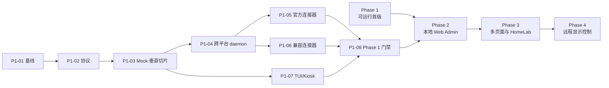

# HomePi Monitor 开发计划

```yaml
plan_id: PLAN-001
status: awaiting-verification
source_of_truth: .vibe
product: HomePi Monitor
phase_order: [phase-1, phase-2, phase-3, phase-4]
phase_1_node_count: 1
phase_1_auth_lifecycle: official-cli-only
history_storage: disabled
total_tasks: 19
tasks_done: 8
tasks_in_progress: 0
tasks_blocked: 0
tasks_todo: 11
overall_progress: 42.1%
phase_progress:
  phase_1: 8/8 = 100%
  phase_2: 0/4 = 0%
  phase_3: 0/4 = 0%
  phase_4: 0/3 = 0%
last_updated: 2026-08-11
next_action: 用户检查 Phase 2 Web Admin 规划与阶段顺延；确认后再提交
```

## 0. Agent 执行协议

本文件面向 Codex、Claude Code 及其他编码 Agent。执行任何任务前，必须先读取：

1. `.vibe/PRD.md`
2. `.vibe/HL-Spec.md`
3. 当前任务对应的 `.vibe/Module-Spec-*.md`
4. 当前任务对应的 `.vibe/Test-Module-*.md`
5. `.vibe/UI-Spec-001-ASCII-Design.md`（涉及 TUI 时）

执行规则：

- 先更新相关 Spec 和测试文档，再修改代码。
- 代码注释、Commit Message 使用英文；项目文档使用中文。
- Provider 秘密只允许在远端 node 本机配置；不得写入仓库、测试夹具、日志或 Agent 输出。
- daemon 只读现有登录态；不得执行登录、登出、OAuth、设备授权、Token 刷新或登录态写回。
- Phase 1 只允许一台主力开发电脑；不得实现多 node 聚合或切换。
- daemon 与 Pi 不保存历史指标；Pi 最多保留一份最近成功快照。
- 测试结束后清理临时脚本、Mock 文件、证书和测试数据。
- 每个任务完成后更新任务状态、实际测试输出和已知限制。
- 每个 Phase 完成后暂停，等待用户手动验收；用户确认前不得执行 Git commit。

任务状态只使用：`TODO`、`IN_PROGRESS`、`BLOCKED`、`DONE`。被阻塞时必须填写 `blocked_by` 和下一步动作。

## 0.5 进度仪表板

> 最后更新：2026-08-11
> 数据来源：下方 3.2、4.2、5.2、6.2 节任务 YAML 头部聚合

| Phase | 任务数 | DONE | IN_PROGRESS | BLOCKED | TODO | 完成率 |
|---|---:|---:|---:|---:|---:|---:|
| Phase 1：可运行首版 | 8 | 8 | 0 | 0 | 0 | 100% |
| Phase 2：本地 Web Admin | 4 | 0 | 0 | 0 | 4 | 0% |
| Phase 3：多页面与 HomeLab | 4 | 0 | 0 | 0 | 4 | 0% |
| Phase 4：远程显示控制 | 3 | 0 | 0 | 0 | 3 | 0% |
| **合计** | **19** | **8** | **0** | **0** | **11** | **42.1%** |

### 0.5.1 任务状态速查表

| 任务 ID | 标题 | Phase | 状态 | 进度 | 验收 | 完成日期 |
|---|---|---|---|---:|---|---|
| P1-01 | 工程与硬件基线 | 1 | DONE | 100% | approved | 2026-08-10 |
| P1-02 | 协议与领域模型 | 1 | DONE | 100% | approved | 2026-08-10 |
| P1-03 | Mock 端到端垂直切片 | 1 | DONE | 100% | approved | 2026-08-10 |
| P1-04 | 跨平台 daemon、配置与安全 | 1 | DONE | 95% | pending | 2026-08-10 |
| P1-05 | 官方连接器 | 1 | DONE | 95% | pending | 2026-08-10 |
| P1-06 | 兼容性连接器 | 1 | DONE | 95% | pending | 2026-08-10 |
| P1-07 | TUI 与 DietPi Kiosk | 1 | DONE | 95% | pending | 2026-08-11 |
| P1-08 | Phase 1 发布门禁 | 1 | DONE | 95% | pending | 2026-08-11 |
| P2-01 | 配置事务与 Provider 管理核心 | 2 | TODO | 0% | pending | — |
| P2-02 | Loopback Web Admin | 2 | TODO | 0% | pending | — |
| P2-03 | Display 配置部署 | 2 | TODO | 0% | pending | — |
| P2-04 | Phase 2 集成门禁 | 2 | TODO | 0% | pending | — |
| P3-01 | 页面路由与自动轮播 | 3 | TODO | 0% | pending | — |
| P3-02 | Prometheus 连接器 | 3 | TODO | 0% | pending | — |
| P3-03 | Grafana 与 Portainer 连接器 | 3 | TODO | 0% | pending | — |
| P3-04 | Phase 3 集成门禁 | 3 | TODO | 0% | pending | — |
| P4-01 | 命令协议与安全校验 | 4 | TODO | 0% | pending | — |
| P4-02 | UI 仲裁与幂等 | 4 | TODO | 0% | pending | — |
| P4-03 | Phase 4 发布门禁 | 4 | TODO | 0% | pending | — |

## 1. 全局完成定义

一个任务只有同时满足以下条件才可标记 `DONE`：

- 代码、配置或文档变更与已认证规格一致。
- 任务的 Unit/Contract/E2E/Security 测试已执行，实际输出已写入 `.vibe/Test-Module-*.md`。
- `go test ./...`、`go vet ./...` 和适用的构建检查通过。
- 无秘密泄露、无未清理临时文件、无越界 TUI 输出。
- 任务交付物可被用户按验收步骤手动复现。

任务从 `DONE` 到 `verification: approved` 还需满足：

- 用户已按"手动验收"步骤实际复现，并明确确认。
- 若验收发现偏差，必须新建一条 `verification: rejected` 记录与未解决问题清单，
  任务回到 `IN_PROGRESS` 或 `TODO`，待修复后重新走验收。

## 1.5 任务状态字段规范

每个任务的 YAML 头部必须按下列规范填写。字段未涉及说明的，可在 `0.5.1` 速查表中省略。

| 字段 | 类型 | 必填 | 含义 |
|---|---|---|---|
| `id` | string | 是 | 任务 ID，与标题一致，如 `P1-04`。 |
| `status` | enum | 是 | `TODO` / `IN_PROGRESS` / `BLOCKED` / `DONE` 四选一。 |
| `progress` | string | 是 | 完成度百分比，如 `0%`、`60%`、`100%`。由交付物完成数 / 总数算出。 |
| `depends_on` | string[] | 是 | 依赖的前置任务 ID 列表；无依赖写 `[]`。 |
| `owner` | string | 是 | 当前执行者 Agent 名称（如 `implementation-agent`）。 |
| `started_at` | date | 否 | 任务首次进入 `IN_PROGRESS` 的日期；`TODO` 阶段不填。 |
| `completed_at` | date | 否 | 任务最后一次代码层面达到 `DONE` 的日期。 |
| `verified_at` | date | 否 | 用户最近一次手动验收的日期。 |
| `verification` | enum | 是 | `pending` / `approved` / `rejected`。代码完成不等于用户验收。 |
| `deliverables` | object[] | 否 | 子交付物完成度，每项含 `name` 和 `status`（同上枚举）。 |
| `risks` | object[] | 否 | 已识别风险，每项含 `description`、`severity`（`low`/`medium`/`high`）、`status`（`open`/`mitigated`/`accepted-by-owner`）。 |
| `blocked_by` | string[] | 否 | 仅在 `status: BLOCKED` 时填写，列出阻塞原因或外部依赖。 |
| `next_action` | string | 否 | 当前阻塞或进行中状态下，下一步必须执行的动作。 |

### 1.5.1 状态迁移规则

```text
TODO ──开始执行──> IN_PROGRESS
IN_PROGRESS ──发现阻塞──> BLOCKED
BLOCKED ──解除阻塞──> IN_PROGRESS
IN_PROGRESS ──代码完成──> DONE (verification=pending)
DONE ──用户验收通过──> DONE (verification=approved)
DONE ──用户验收驳回──> IN_PROGRESS
```

每次迁移必须在「实际结果」段落追加一行变更说明（日期 + 触发条件 + 关键证据）。

### 1.5.2 进度计算规则

- 先计算 `raw_progress = ceil(已完成 deliverable 数 / 总 deliverable 数 × 100%)`；
  `verification: pending` 时任务展示进度最高为 `95%`，用户批准后才显示 `100%`。
- `deliverables` 与下方"交付内容"段落的列表项一一对应，未列出的不计入分母。
- `progress: 100%` 时必须同时满足 `status: DONE` 与 `verification: approved`。

## 2. 依赖关系



## 2.5 当前可开始的任务

> 最后更新：2026-08-11
> 解锁规则：任务的 `depends_on` 全部 `status: DONE` 且 `verification: approved` 时可开始。

### 2.5.1 当前状态

| 任务 ID | 自动化状态 | 用户验收 | 下一步 |
|---|---|---|---|
| P1-04 | 代码与自动化完成 | pending | 本机 macOS daemon → Pi 真实链路；Windows/Linux daemon 暂缓 |
| P1-05/P1-06 | 五连接器契约与安全门禁完成 | pending | IMPL-003 §10 真实账号对账 |
| P1-07 | TUI/Kiosk 与 Pi 实机功能完成 | pending | 用户确认 framebuffer/实屏 |
| P1-08 | 软件交付与当前验收剖面完成 | pending | 用户检查；真实账号与暂缓平台作为补充验证 |

本轮按用户明确的「完成 Phase 1」目标先完成全部可本机执行的实现与门禁；正式用户验收仍按
P1-04 → P1-05/P1-06/P1-07 → P1-08 的依赖顺序确认，任一步驳回都回退对应任务。

实机验收范围变更（2026-08-11）：产品所有者要求暂时忽略 Windows 测试主机，先测试本地 Mac。
因此本轮使用本机 macOS 作为唯一 daemon，目标 Pi 作为 display；Windows 与额外 Linux daemon
生命周期记录为明确暂缓项，不阻止当前 Mac/Pi 验收，但也不宣称这两个平台已完成实机验证。

### 2.5.2 当前阻塞

| 任务 ID | 阻塞原因 | 解锁条件 |
|---|---|---|
| P2-01..P2-04 | P1-08 `verification` 尚未获用户批准 | P1-08 `verification: approved` |
| P3-01..P3-04 | depends_on P2-04 未完成 | P2-04 `status: DONE` |
| P4-01..P4-03 | depends_on P3-04 未完成 | P3-04 `status: DONE` |

### 2.5.3 已知跨任务风险（影响解锁判断）

- P1-08 的 24 小时稳定性测试依赖欠压消除或显式延期结论；当前属「产品所有者已接受延期」，
  不构成 P1-08 的代码完成阻塞，但用户验收时必须看到电源状态说明。

## 3. Phase 1：可运行的 Coding Usage Dashboard

### 3.1 Phase 1 目标

交付一台 Raspberry Pi 与一台主力开发电脑之间的完整系统：远端 `homepi-node` 在 macOS、Windows PowerShell、Linux 上运行，Pi 以 60×20 ASCII Kiosk 展示 MiniMax Coding Plan、Codex Usage、Kimi Coding Plan、DeepSeek API 和 Kimi API 五类数据。

### 3.2 Phase 1 任务清单

#### P1-01 工程与硬件基线

```yaml
id: P1-01
status: DONE
progress: 100%
depends_on: []
owner: implementation-agent
started_at: 2026-08-08
completed_at: 2026-08-10
verified_at: 2026-08-10
verification: approved
deliverables:
  - name: 建立 Go module、cmd/homepi-node、cmd/homepi-display、internal/ 和构建入口
    status: DONE
  - name: 记录 macOS、Windows、Linux、Pi 的实际版本和构建目标
    status: DONE
  - name: 记录 Pi 的 DietPi、内核、TTY、字体、屏幕驱动、旋转和供电状态
    status: DONE
  - name: 欠压告警处理（消除或标记稳定性测试 BLOCKED）
    status: DONE
  - name: 确认 LAN TLS/配对方案（默认 TLS 证书指纹固定 + 单设备 Token）
    status: DONE
risks:
  - description: 欠压告警未消除
    severity: medium
    status: accepted-by-owner
    deferral: 上线后处理
    impact: P1-08 24 小时稳定性测试需在结果中注明电源状态
```

交付内容：

- 建立 Go module、`cmd/homepi-node`、`cmd/homepi-display`、`internal/` 和构建入口。
- 记录 macOS、Windows、Linux、Pi 的实际版本和构建目标。
- 记录 Pi 的 DietPi、内核、TTY、字体、屏幕驱动、旋转和供电状态。
- 消除 `Undervoltage detected!`；若未消除，将硬件稳定性任务标记 `BLOCKED`。
- 确认 LAN TLS/配对方案；默认采用 TLS 证书指纹固定 + 单设备 Token。

验证：

- `homepi-node --version` 和 `homepi-display --version` 可运行。
- 目标构建矩阵可重复生成：darwin/amd64、darwin/arm64、windows/amd64、linux/amd64、linux/arm64、linux/arm/v7。
- Pi doctor 输出实际 TTY 尺寸和供电状态。

实际结果（2026-08-10）：

- 完成：Go module、两个 cmd 入口、13 个 internal 包、`Makefile`。
- 完成：两个二进制的 `--version` 输出版本、commit、构建时间、平台与 Go 版本。
- 完成：`make checksums` 生成六平台 × 两个二进制共 12 个产物与 SHA256 校验和。
- 完成：LAN 方案确认为 TLS 证书指纹固定 + 单设备 Token；Token 部分已实现（256-bit、
  常数时间比较、设备作用域、经环境变量传递），TLS 终止属 P1-04。
- 完成：`homepi-display doctor` 经 `TIOCGWINSZ` 读取实际 TTY 尺寸并与 60×20 基线比对告警。
- 完成：Pi 实机回填已到。DietPi 10.6.2 RC2 / Debian 12 bookworm，内核 6.12.96 aarch64，
  Pi 3 B+ Rev 1.3，TTY `20 60`，480×320 + `dtoverlay=tft35a:rotate=90`，fb0，font 8×16，
  IP 192.168.31.166。实际 TTY 尺寸精确命中 UI-001 60×20 推断基线。
- 风险（产品所有者已接受）：欠压（`vcgencmd get_throttled=0x50005`，含 bit0=1 当前欠压、
  bit2=1 当前节流）仍未消除。PRD §M0 / HL-Spec §11 要求在无欠压条件下做 24 小时稳定性
  测试；用户决定延期至产品上线后处理电源，本轮不作为开发 BLOCKER。P1-08 跑稳定性测试时
  必须在结果记录中注明电源状态。

详见 `.vibe/IMPL-001-Phase1-P1-01-to-P1-03.md`。

手动验收：用户在 Pi 查看硬件诊断，在各主力电脑运行版本命令，并确认供电告警已消失。

#### P1-02 协议与领域模型

```yaml
id: P1-02
status: DONE
progress: 100%
depends_on: [P1-01]
owner: implementation-agent
started_at: 2026-08-09
completed_at: 2026-08-10
verified_at: 2026-08-10
verification: approved
deliverables:
  - name: 实现 MetricSnapshot、ProviderMetric、ConnectorHealth、source_epoch、snapshot_version
    status: DONE
  - name: 实现 JSON schema、快照全量接口、WebSocket 事件、心跳与错误模型
    status: DONE
  - name: 实现单 node 来源校验，拒绝第二个活动 node
    status: DONE
  - name: 实现 LIVE / DELAYED / STALE / AUTH / N/A / ERROR 状态语义
    status: DONE
risks: []
```

交付内容：

- 实现 `MetricSnapshot`、`ProviderMetric`、`ConnectorHealth`、`source_epoch` 和 `snapshot_version`。
- 实现 JSON schema、快照全量接口、WebSocket 事件、心跳和错误模型。
- 实现单 node 来源校验，拒绝第二个活动 node。
- 实现 `LIVE`、`DELAYED`、`STALE`、`AUTH`、`N/A`、`ERROR` 状态语义。

验证：

- 序列化往返、未知字段、旧版本拒绝和 daemon 重启 epoch 测试通过。
- 协议响应不包含 Token、Cookie、Authorization Header、`auth.json` 内容或原始 Provider 响应。

实际结果（2026-08-10）：

- 全部交付项完成。位于 `internal/protocol`、`internal/state`、`internal/nodeapi`。
- 序列化往返保留精确 decimal（`0.1` 往返仍为 `0.1`）；未知字段被忽略；主版本不兼容被拒绝；
  epoch 变化时版本从 0 重启被接受，同 epoch 内版本回退被拒绝。
- 状态语义按 HL-Spec 7 的顺序求值（认证 → 可用性 → 传输错误 → 新鲜度 → 数值），
  `estimated`/`manual` 精度封顶 WARN。
- 脱敏：协议类型结构上不含任何凭据字段；`protocol.AuditJSON` 对 18 个禁用键与植入的假 Key
  扫描快照、HTTP 响应、健康探针与落盘文件，均无命中；审计器本身有反向验证用例。
- 偏差：`snapshot_delta` 消息类型已定义但服务端 Phase 1 只发 `snapshot_full`，
  理由见 IMPL-001 3.2。

手动验收：使用固定 JSON 快照验证版本前进、版本回退、来源错误和状态展示。

#### P1-03 Mock 端到端垂直切片

```yaml
id: P1-03
status: DONE
progress: 100%
depends_on: [P1-02]
owner: implementation-agent
started_at: 2026-08-09
completed_at: 2026-08-10
verified_at: 2026-08-10
verification: approved
deliverables:
  - name: Mock Connector、Scheduler、内存 Current State 与 LAN Mock API
    status: DONE
  - name: Pi 同步客户端、原子替换的唯一最近成功快照和断线重连
    status: DONE
  - name: UI-001 Phase 1 正常、离线、AUTH、无快照 ASCII golden screen
    status: DONE
  - name: FIX-001 审查整改：失败传播、空快照门禁、Retry-After 硬下限、退避重置、fsync
    status: DONE
risks: []
```

交付内容：

- Mock Connector、Scheduler、内存 Current State 和 LAN Mock API。
- Pi 同步客户端、原子替换的唯一最近成功快照和断线重连。
- UI-001 Phase 1 正常、离线、AUTH、无快照 ASCII golden screen。

验证：

- Mock 数据变化后 Pi 在规格时限内更新。
- 断网显示最近成功快照和 STALE；重启 Pi 不创建历史文件。
- 三个完整画面严格为 60×20，每行不超过 60 个终端单元。

实际结果（2026-08-10）：

- 全部交付项完成。交付了四个 golden screen（正常、离线、AUTH、无快照），
  固化于 `internal/ui/testdata/`，并已回写 UI-Spec-001 第 4、5 节。
- 网格保证：正常/离线/AUTH/空/严重/恶意输入六种模型，每帧恰好 20 行 × 60 单元，
  全部字节位于 0x20–0x7e。恶意输入含超长名称、999%、ANSI 转义与控制字符。
- 数据流：编辑 `examples/mock-fixture.json` 后屏幕在数秒内更新（自动化 + 手动均验证）。
- 断网：保留最近成功值、顶栏 OFFLINE、页脚 DATA STALE / LAST SYNC / RETRYING，
  时间推进后卡片转 STALE，无伪造零值。
- 无历史：100 次写入与手动冒烟的 175 个快照版本后，数据目录恒为一个
  `last-known-good.json`；损坏文件被隔离且不导致进程退出。
- 本轮由测试发现并修复三个实现缺陷（ETag 永不命中、reset 倒计时低估、断网时 OFFLINE
  被 CRIT 掩盖），均已加回归用例，详见 Test-Module-002 第 5 节。
- FIX-001 审查整改补齐真实连接器失败到 TUI 的状态传播、空 daemon 快照门禁、Retry-After
  硬下限、Health 连续失败状态、健康会话退避重置、父目录 fsync，并将 `.vibe` 文档纳入版本控制。

手动验收：不使用任何真实 Key，用户可在开发机修改 Mock 数据并在 Pi 屏幕看到变化、断网和恢复。
开发机代替 Pi 的等价验收步骤见 `.vibe/IMPL-001-Phase1-P1-01-to-P1-03.md` 第 7 节
（`make run-node` + `make run-display`）。

#### P1-04 跨平台 daemon、配置与安全

```yaml
id: P1-04
status: DONE
progress: 95%
depends_on: [P1-03]
owner: implementation-agent
started_at: 2026-08-10
completed_at: 2026-08-10
verification: pending
deliverables:
  - name: provider add/edit/list/test/remove 和 doctor 命令
    status: DONE
  - name: region、Base URL、刷新周期、秘密引用与单活动 node 配置校验
    status: DONE
  - name: macOS Keychain、Windows Credential Manager/DPAPI、Linux Secret Service 适配
    status: DONE
  - name: macOS LaunchAgent、Windows PowerShell 后台任务、Linux systemd --user
    status: DONE
  - name: TLS、证书指纹固定、设备 Token、撤销与 LAN 访问控制
    status: DONE
  - name: 认证过期只返回 blocked_auth，禁止登录/OAuth/刷新/写回
    status: DONE
risks:
  - description: e2e 测试在并发/race 模式下偶发失败（TestOfflineOutranksCriticalInHeader、TestMockDataFlowsToScreen、TestForeignSnapshotIsRejected）
    severity: low
    status: mitigated
    impact: 已改为 snapshot_version/connected 同步并等待后台退出；race 连续 10 轮通过
next_action: 以本机 macOS daemon 建立到目标 Pi 的真实 TLS/设备鉴权链路；Windows 与额外 Linux daemon 暂缓
```

交付内容：

- `provider add/edit/list/test/remove` 和 `doctor` 命令。
- region、Base URL、刷新周期、秘密引用和单活动 node 配置校验。
- macOS Keychain、Windows Credential Manager/DPAPI、Linux Secret Service 适配；受限文件回退必须告警。
- macOS LaunchAgent、Windows 当前用户 PowerShell 后台任务、Linux `systemd --user`。
- TLS、证书指纹固定、设备 Token、撤销和 LAN 访问控制。
- 认证过期时只返回 `blocked_auth`，不执行官方 CLI、不执行 OAuth、不刷新、不写回。

验证：

- 三平台 install/start/status/stop/uninstall 一致。
- 配置第二个 node、错误 URL、SSRF、错误 Token 均在启动或连接前拒绝。
- 认证过期测试确认无登录子进程、无 refresh 请求、无登录态文件修改。

手动验收：产品完整矩阵仍要求 macOS、Windows PowerShell、Linux 各完成一次安装和配置；当前
经产品所有者明确缩小的验收剖面先完成 macOS，并让 Pi 只连接该唯一 node。其余平台保留补测记录。

状态变更（2026-08-10）：P1-04 由 IN_PROGRESS 转 DONE；触发条件为遗留 E2E flaky 已整改，
`make check`、全仓 race 与 E2E race 连续 10 轮通过。`verification` 保持 pending。

真实 macOS 验收（2026-08-10）：全新默认目录依次执行 config init/validate、install、start、
status、stop、uninstall；发现并修复已停止 LaunchAgent 返回 `No process to signal.` 导致卸载中断，
修复后完整生命周期通过，launchd job/plist 均清除，测试专用配置、证书、日志和二进制已删除。
Windows 与 Linux 实机仍待执行，因此 `verification` 不变。

验收边界变更（2026-08-11）：产品所有者明确要求暂缓 Windows，先测本机 Mac；额外 Linux daemon
也不在当前拓扑中。本轮以 macOS daemon → Pi 的真实链路补齐 P1-04 集成证据，不把暂缓平台写成通过。

#### P1-05 官方连接器

```yaml
id: P1-05
status: DONE
progress: 95%
depends_on: [P1-04]
owner: implementation-agent
started_at: 2026-08-10
completed_at: 2026-08-10
verification: pending
deliverables:
  - name: DeepSeek API /user/balance
    status: DONE
  - name: Kimi API /v1/users/me/balance
    status: DONE
  - name: MiniMax Token Plan 主路径与 Coding Plan 兼容路径
    status: DONE
  - name: decimal 金额、窗口、重置时间、观察时间和精度状态标准化
    status: DONE
risks:
  - description: 本机无三个 Provider 的真实测试账号，尚未与官方控制台对账
    severity: medium
    status: open
    impact: 契约测试通过不等于真实账号验收通过
next_action: 用户按 IMPL-003 §10 配置真实账号并逐项对账
```

交付内容：

- DeepSeek API `/user/balance`。
- Kimi API `/v1/users/me/balance`。
- MiniMax Token Plan 主路径和 Coding Plan 兼容路径。
- decimal 金额、窗口、重置时间、观察时间和精度状态标准化。

验证：

- 官方响应契约测试、401/403/429/5xx/超时/schema_changed 测试通过。
- 真实测试账号与官方控制台/接口结果逐项对账。

手动验收：用户在远端配置三个 Provider，Pi 显示余额和窗口，日志与快照无秘密。

实际结果（2026-08-10）：三个官方连接器及共享 HTTP 门禁完成；金额使用 exact decimal，
MiniMax 主/兼容路径有界回退；401/403/429/5xx/timeout/schema_changed 自动化通过。
状态由 TODO 转 DONE，`verification` 因真实账号对账未执行而保持 pending。

#### P1-06 兼容性连接器

```yaml
id: P1-06
status: DONE
progress: 95%
depends_on: [P1-04]
owner: implementation-agent
started_at: 2026-08-10
completed_at: 2026-08-10
verification: pending
deliverables:
  - name: Codex 本机登录态只读解析与 wham/usage
    status: DONE
  - name: Kimi Coding /usages（404 时回退 /usage 仅一次）
    status: DONE
  - name: 脱敏契约夹具、字段白名单与兼容接口错误降级
    status: DONE
risks:
  - description: Codex 正常态真实请求已通过；Codex 过期/续期恢复与 Kimi Coding 真实订阅仍待验证
    severity: medium
    status: open
    impact: 兼容端点完整故障矩阵与真实数值对账尚未闭环
next_action: 用户按 IMPL-003 §10 完成 Codex 控制台对账/过期续期与 Kimi Coding 真实验证
```

交付内容：

- Codex 本机登录态只读解析和 `wham/usage`。
- Kimi Coding `/usages`，404 时只回退 `/usage` 一次。
- 脱敏契约夹具、字段白名单、兼容接口错误降级。

验证：

- 兼容接口 schema 变化显示 `N/A`/`AUTH`，不生成错误数值。
- 官方 CLI 续期后，daemon 下一轮只读重新采集；daemon 永不执行续期。

手动验收：用户在远端完成官方 CLI 登录，观察正常用量；使登录态过期，确认 AUTH；官方 CLI 续期后观察自动恢复。

实际结果（2026-08-10）：Codex 只读 `auth.json`、wham 标准化、Kimi `/usages` 与单次 404
回退完成；文件 hash/mode/size/mtime 不变、无 refresh/OAuth/login 请求、符号链接/第三方格式拒绝。
本机真实 Codex 正常态请求发现默认 HTTP/2 兼容失败，固定 HTTP/1.1 后在不设置 `GODEBUG` 的
情况下成功解析 1 个指标，采集前后 auth 文件 hash/mode/size/mtime/inode 完全不变；数值控制台
对账与过期/续期恢复仍待用户执行。
状态由 TODO 转 DONE，`verification` 保持 pending。

#### P1-07 TUI 与 DietPi Kiosk

```yaml
id: P1-07
status: DONE
progress: 95%
depends_on: [P1-03]
owner: implementation-agent
started_at: 2026-08-10
completed_at: 2026-08-11
verification: pending
deliverables:
  - name: UI-001 60×20 ASCII Phase 1 首屏与状态变体
    status: DONE
  - name: DietPi rich 彩色线框主题与 ASCII 降级
    status: DONE
  - name: 无 stdin/mouse/触摸键盘依赖，隐藏光标，确定性重绘
    status: DONE
  - name: DietPi systemd + autostart、崩溃退避与启动恢复
    status: DONE
  - name: Pi 温度、CPU、内存、LAN 状态采集
    status: DONE
risks:
  - description: Pi 60×20 实屏、冷启动、自启、RSS/CPU 短样本已执行；稳定资源趋势受供电影响
    severity: medium
    status: accepted-by-owner
    impact: framebuffer 已证明布局；间歇性欠压修复后仍需补 1 小时资源趋势
  - description: 首次 enable --now 时 getty 退出清屏覆盖 Kiosk 首帧
    severity: high
    status: mitigated
    impact: 已增加 After=getty@tty1.service；Pi 从 active getty 启动后完整首屏保留
  - description: 强制停止可能遗留原子快照临时文件
    severity: medium
    status: mitigated
    impact: 启动清理普通临时文件并拒绝符号链接；Pi 遗留文件从 1 个恢复为 0
next_action: 用户确认 framebuffer/物理屏；供电长时程限制已获例外接受
```

交付内容：

- 实现 UI-001 60×20 ASCII Phase 1 首屏和状态变体。
- 无 stdin、无 mouse mode、无触摸/键盘依赖、隐藏光标和确定性重绘。
- DietPi systemd + autostart、崩溃退避和启动恢复。
- Pi 温度、CPU、内存、LAN 状态。

验证：

- `go test ./...` 的 golden screen、16 色、无色终端、截断和无输入测试通过。
- RSS ≤120 MB、CPU 平均 ≤5%、正常重绘 ≤2 FPS。
- 损坏快照不导致 TUI 退出，且数据目录最多一份最近成功快照。

手动验收：无键盘、无触摸、stdin 关闭时 Pi 冷启动进入 overview；模拟 LIVE/OFFLINE/AUTH/CRIT/空状态并确认无滚动。

实际结果（2026-08-10）：60×20 golden、Pi health、无输入输出生命周期、tty1 systemd、0600
环境文件、10 秒崩溃退避、小终端诊断页均通过自动化。状态由 TODO 转 DONE，
`verification` 因 Pi 实机未执行而保持 pending。

视觉升级（2026-08-11）：用户验收认为纯黑白界面不够美观，P1-07 重新进入 IN_PROGRESS。
当前 DietPi 只读基线为 `TERM=linux`、8 个基础色、UTF-8 mode、`C.UTF-8`、Fixed 8×16；
实现默认 rich 彩色线框/块状进度条，同时保留逐字节 ASCII golden 降级，最终以 framebuffer 截图验收。

视觉升级结果（2026-08-11）：rich/ASCII focused、全仓标准/race、连续 10 轮 race、12 目标构建与
SHA 自校验全部通过。ARM64 新版部署后 service active、0 重启、无 warning；真实 480×320
framebuffer 显示蓝/青/洋红/绿/白多层语义色及完整线框/块字符。ASCII 隔离冒烟无 rich SGR/字形，
截图为 `.vibe/evidence/Phase1-Pi-Screen-Rich.png`。P1-07 返回 DONE，`verification` 等待用户检查。

第二轮配色反馈（2026-08-11）：用户要求边框更亮、进度条改为黄色与青色组合。P1-07 暂时
重新进入 IN_PROGRESS；契约确定为亮青边框、亮青括号/剩余块与亮黄已消耗块，状态徽标配色保持独立。

第二轮配色结果（2026-08-11）：focused、全仓标准/race、连续 10 轮 race、12 目标 SHA 门禁
全部通过。ARM64 新版 SHA 为 `7310dc3f...5039b`；Pi service active、0 重启/0 warning。
480×320 framebuffer 证明边框已提升为亮青，进度为亮青剩余 + 亮黄已消耗，状态徽标颜色未改变；
证据为 `.vibe/evidence/Phase1-Pi-Screen-Rich-Bright.png`。P1-07 返回 DONE，等待用户检查。

#### P1-08 Phase 1 发布门禁

```yaml
id: P1-08
status: DONE
progress: 95%
depends_on: [P1-05, P1-06, P1-07]
owner: implementation-agent
started_at: 2026-08-10
completed_at: 2026-08-11
verification: pending
deliverables:
  - name: 六目标构建产物、校验和、版本信息与安装/回退文档
    status: DONE
  - name: 五连接器完整回归、安全扫描、故障矩阵
    status: DONE
  - name: 24 小时硬件稳定性报告（含电源状态）
    status: DONE
  - name: 更新对应 .vibe/Test-Module-*.md 实际结果与已知限制
    status: DONE
risks:
  - description: 重启后出现 0x50005；本次启动累计 7 次欠压检测，收尾为 0xD0000 并新增历史 soft temperature limit 位
    severity: medium
    status: accepted-by-owner
    impact: 产品所有者于 2026-08-11 明确要求忽略供电问题并继续开发；报告保留事实但不阻塞本轮完成
next_action: 用户检查并确认当前 Mac/Pi 交付；真实账号对账与暂缓平台作为补充验证
```

交付内容：

- 六个目标构建产物、校验和、版本信息和安装/回退文档。
- 五连接器完整回归、安全扫描、故障矩阵和 24 小时硬件稳定性报告。
- 更新所有对应 `.vibe/Test-Module-*.md` 的实际结果和已知限制。

验证：

- 全新 DietPi + 一台主力电脑可按文档安装。
- 在线、断网、Pi 重启、错误 Key、登录过期、官方 CLI 续期、版本回退均可复现。
- 24 小时期间无欠压、崩溃、花屏、RSS 持续增长或日志暴涨；本轮供电项按产品所有者明确指令
  作为 accepted-by-owner 例外，不得写成技术通过。

Phase 1 手动验收完成后，暂停并等待用户确认，再进入 Phase 2。

实际结果（2026-08-10）：

- 12 个跨平台产物生成并完成 SHA-256 自校验；修复了重复执行时清单包含自身的发布缺陷。
- 191 个测试/子测试、全仓 race、E2E race 连续 10 轮、`go mod verify`、`govulncheck` 通过。
- 安装、回退、真实 Provider 对账与 24 小时检查步骤已写入 IMPL-003。
- Codex 正常态真实请求与 macOS 服务生命周期已通过；其余四个真实账号、Codex 过期/续期、
  Windows/Linux 服务生命周期、控制台数值对账、24 小时硬件报告和 Pi 实屏/资源数据尚未执行，
  因此当时保持 IN_PROGRESS。

实机恢复记录（2026-08-11）：`ssh dietpi` 已以 `root` 连入目标 Pi；确认 Debian 12/ARM64、
`tty1=60×20`、HomePi binary/config/unit/data 均不存在。`get_throttled=0x50000` 仅含历史位，
当前欠压/节流位为 0。Windows 与额外 Linux daemon 按产品所有者指令暂缓，本轮转入 Mac/Pi 验收。

首次部署缺陷（2026-08-11）：Mac/Pi TLS 与设备鉴权成功、Pi 快照已落盘，但首次
`systemctl enable --now` 后 `/dev/vcs1` 全空白；直接写 tty1 正常，停止并重启 Kiosk 后首屏正常。
P1-07/P1-08 暂不通过，先修复 getty/display 启停顺序并执行冷启动回归。

Mac/Pi 实机结果（2026-08-11）：TLS/设备鉴权、60×20 framebuffer、断线恢复、SIGKILL 退避、
版本回退与恢复、Pi 重启自启均通过；修复 getty 首帧竞态和中断临时快照遗留。完整自动化、
race、12 产物 SHA、漏洞与许可证门禁通过。Pi 重启后出现间歇性 `0x50005`，收尾为 `0xD0000`，
本次启动累计 7 条欠压检测且新增历史 soft temperature limit 位，
24 小时门禁按失败提前终止；四个非 Codex 真实账号也仍不可用，因此 P1-08 转 BLOCKED。

产品决策（2026-08-11）：产品所有者随后明确指示“供电问题请忽略，直接继续开发”。因此保留
`0x50005`、7 次欠压事件和收尾 `0xD0000` 的原始证据，但将供电稳定性作为 accepted-by-owner
例外，不再阻塞本轮软件交付。Mac/Pi 当前验收剖面、完整自动化、安全门禁、故障矩阵、回退与
重启自启均完成，P1-08 由 BLOCKED 转 DONE，`verification` 保持 pending；真实账号对账和
Windows/额外 Linux 实机不伪写为通过，转为用户批准前可补充的外部验证项。

## 4. Phase 2：本地 Web Admin 与配置编排

### 4.1 Phase 2 目标

在不改变 Phase 1 凭据边界、单 node、Pi 无输入和无历史指标原则的前提下，将 Provider、
系统凭据引用、daemon 应用和 Display 持久参数统一到远端主机 loopback Web Admin。现有 CLI
保留并与 Web Admin 复用同一配置事务；Pi 不增加设置页面或入站管理端口。

### 4.2 Phase 2 任务清单

#### P2-01 配置事务与 Provider 管理核心

```yaml
id: P2-01
status: TODO
progress: 0%
depends_on: [P1-08]
owner: implementation-agent
verification: pending
deliverables:
  - name: 共享 Config Transaction Service 与 revision/diff 草稿模型
    status: TODO
  - name: Provider 类型化校验、草稿只读测试和内存秘密 overlay
    status: TODO
  - name: 版本化秘密引用、原子保存、服务健康确认和补偿回滚
    status: TODO
  - name: CLI Provider/Config/Service 复用共享服务且保持兼容
    status: TODO
risks:
  - description: Keychain 与配置文件无法形成单存储原子事务
    severity: high
    status: open
blocked_by: [P1-08]
```

交付内容：共享配置事务、草稿 revision/diff、Provider 类型化表单元数据、候选秘密 overlay、
版本化 Keychain 引用、daemon 应用/健康确认/回滚，以及现有 CLI 兼容层。

验证与验收：使用草稿测试真实 Codex 时配置和 Keychain 不变；Apply 成功后服务加载新 revision；
注入保存或启动失败时上一份配置、秘密引用和服务状态自动恢复。

#### P2-02 Loopback Web Admin

```yaml
id: P2-02
status: TODO
progress: 0%
depends_on: [P2-01]
owner: implementation-agent
verification: pending
deliverables:
  - name: homepi-node configure 与嵌入式 HTML/CSS/JavaScript
    status: TODO
  - name: Overview、Provider 草稿/测试/差异/Apply 页面
    status: TODO
  - name: Host/Origin/CSRF/SameSite/CSP/CORS 与脱敏 API
    status: TODO
  - name: 磁盘配置、运行中配置和 Pi 快照三层状态展示
    status: TODO
risks:
  - description: 本地 Web 页面被误绑定到 LAN 或受 DNS rebinding/CSRF 影响
    severity: high
    status: open
blocked_by: [P2-01]
```

交付内容：只监听 loopback 的单二进制 Web Admin、Provider 卡片、动态表单、草稿测试、差异预览、
一次 Apply、脱敏状态和浏览器安全响应头；不依赖 CDN、外部字体或 Node.js 运行时。

验证与验收：用户在本机浏览器新增/测试 `codex-main`、停用 mock 并一次 Apply；不手工编辑 JSON
或执行服务命令。非 loopback 监听、非同源 Origin、缺失 CSRF 和密钥 query 均被拒绝。

#### P2-03 Display 配置部署

```yaml
id: P2-03
status: TODO
progress: 0%
depends_on: [P2-02]
owner: implementation-agent
verification: pending
deliverables:
  - name: 非秘密 Display Profile 与当前/期望状态差异
    status: TODO
  - name: homepi-display config validate
    status: TODO
  - name: 固定允许操作的 SSH 候选写入、原子替换和 systemd 重启
    status: TODO
  - name: WebSocket/快照健康确认与 .previous 回滚
    status: TODO
risks:
  - description: SSH 中断或错误环境导致 Kiosk 离线
    severity: high
    status: open
blocked_by: [P2-02]
```

交付内容：Display 配置页、自动推导 source ID/证书指纹/设备凭据引用、`rich|ascii` 主题、
候选环境校验、固定 SSH allowlist、原子替换、systemd 重启、WebSocket/快照确认和失败回滚。

验证与验收：用户在 Web Admin 将 `dietpi` 从 rich 切换到 ASCII 并切回，无需手工 SSH；断开 SSH、
注入错误环境或模拟启动失败时 Pi 保留或恢复上一份环境，不新增入站端口。

#### P2-04 Phase 2 集成门禁

```yaml
id: P2-04
status: TODO
progress: 0%
depends_on: [P2-02, P2-03]
owner: implementation-agent
verification: pending
deliverables:
  - name: Config/Web/SSH 安全与秘密扫描门禁
    status: TODO
  - name: 配置事务、服务与 Display 故障注入/回滚矩阵
    status: TODO
  - name: macOS + DietPi 浏览器到实屏 E2E 验收记录
    status: TODO
  - name: 用户操作手册、CLI 救援路径和平台限制报告
    status: TODO
risks: []
blocked_by: [P2-02, P2-03]
```

交付内容：Phase 2 全回归、安全头/端口/秘密扫描、故障注入、事务回滚、Mac→Pi 实机结果、
操作手册和 CLI 救援路径；Windows/Linux 自动化与交叉构建单独报告，实机不伪写通过。

手动验收：浏览器完成真实 Codex 切换与 rich/ASCII Display 切换；错误 Key、配置保存失败、daemon
启动失败、SSH 中断和 Pi unit 失败均保持或恢复上一有效状态，日志/响应/快照无 Provider Key。

Phase 2 手动验收完成后，暂停并等待用户确认，再进入 Phase 3。

## 5. Phase 3：多页面与 HomeLab

### 5.1 Phase 3 目标

在不改变 Phase 1 凭据边界、LAN 连接和无历史指标原则的前提下，加入页面轮播和 HomeLab
当前状态摘要。Phase 3 不改变单 node 约束，持久参数可由 Phase 2 Web Admin 配置。

### 5.2 Phase 3 任务清单

#### P3-01 页面路由与自动轮播

```yaml
id: P3-01
status: TODO
progress: 0%
depends_on: [P2-04]
owner: implementation-agent
verification: pending
deliverables:
  - name: CODING / API / HOMELAB / SERVICES / SYSTEM 五页
    status: TODO
  - name: 页面顺序配置与停留时间
    status: TODO
  - name: 告警抢占与恢复位置
    status: TODO
risks: []
blocked_by: [P2-04]
```

交付内容：`CODING`、`API`、`HOMELAB`、`SERVICES`、`SYSTEM` 五页、页面顺序配置、停留时间、告警抢占和恢复位置。

验证与验收：五页在 60×20 屏按配置轮播；告警结束后恢复原页面；无本地按键或触摸提示。

#### P3-02 Prometheus 连接器

```yaml
id: P3-02
status: TODO
progress: 0%
depends_on: [P3-01]
owner: implementation-agent
verification: pending
deliverables:
  - name: 固定低基数 instant PromQL（up、CPU、内存、磁盘、网络）
    status: TODO
  - name: 查询预算、超时与结果上限
    status: TODO
  - name: 告警摘要聚合
    status: TODO
risks: []
blocked_by: [P3-01]
```

交付内容：固定低基数 instant PromQL、`up`、CPU、内存、磁盘、网络和告警摘要；查询预算、超时和结果上限。

验证与验收：Prometheus 目标停止后仅对应节点变红；Prometheus 不可达不推断所有目标 down；Pi 只收到聚合当前值。

#### P3-03 Grafana 与 Portainer 连接器

```yaml
id: P3-03
status: TODO
progress: 0%
depends_on: [P3-01]
owner: implementation-agent
verification: pending
deliverables:
  - name: Grafana 健康、版本、告警摘要
    status: TODO
  - name: Portainer 健康、环境、容器摘要
    status: TODO
  - name: 版本能力探测与只读 Token
    status: TODO
risks: []
blocked_by: [P3-01]
```

交付内容：Grafana 健康、版本、告警摘要；Portainer 健康、环境、容器摘要；版本能力探测和只读 Token。

验证与验收：认证错误与服务离线可区分；所有请求为只读；不解析 HTML、不调用状态修改接口。

#### P3-04 Phase 3 集成门禁

```yaml
id: P3-04
status: TODO
progress: 0%
depends_on: [P3-02, P3-03]
owner: implementation-agent
verification: pending
deliverables:
  - name: Phase 3 回归测试
    status: TODO
  - name: 性能报告
    status: TODO
  - name: 五页 ASCII/颜色降级检查
    status: TODO
  - name: 实屏验收记录
    status: TODO
risks: []
blocked_by: [P3-02, P3-03]
```

交付内容：Phase 3 回归测试、性能报告、五页 ASCII/颜色降级检查和实屏验收记录。

手动验收：用户看到五页自动轮播；分别停止 node_exporter、Grafana、Portainer，只有相关页面/卡片异常；Coding 页面继续更新。

Phase 3 手动验收完成后，暂停并等待用户确认，再进入 Phase 4。

## 6. Phase 4：远程显示控制

### 6.1 Phase 4 目标

允许唯一已配对的远端 node 改变 Pi 显示状态，但不能执行任意 Shell、登录操作、文件操作或主机管理操作。

### 6.2 Phase 4 任务清单

#### P4-01 命令协议与安全校验

```yaml
id: P4-01
status: TODO
progress: 0%
depends_on: [P3-04]
owner: implementation-agent
verification: pending
deliverables:
  - name: 允许列表命令、command ID、target、issued/expires、sequence
    status: TODO
  - name: 参数 schema、来源校验、ACK 状态机
    status: TODO
  - name: 未知命令/错设备/过期/越界/ANSI 控制字符/重放拒绝
    status: TODO
risks: []
blocked_by: [P3-04]
```

交付内容：允许列表命令、command ID、target、issued/expires、sequence、参数 schema、来源校验和 ACK 状态机。

验证与验收：未知命令、错设备、过期命令、越界参数、ANSI 控制字符和重放全部拒绝。

#### P4-02 UI 仲裁与幂等

```yaml
id: P4-02
status: TODO
progress: 0%
depends_on: [P4-01]
owner: implementation-agent
verification: pending
deliverables:
  - name: show_page、轮播控制、刷新
    status: TODO
  - name: 受限消息、可选亮度、告警抢占
    status: TODO
  - name: 超时恢复与有界幂等记录
    status: TODO
risks: []
blocked_by: [P4-01]
```

交付内容：`show_page`、轮播控制、刷新、受限消息、可选亮度、告警抢占、超时恢复和有界幂等记录。

验证与验收：合法命令在目标时限内生效；相同 command ID 重放十次只执行一次；消息到期恢复之前页面。

#### P4-03 Phase 4 发布门禁

```yaml
id: P4-03
status: TODO
progress: 0%
depends_on: [P4-02]
owner: implementation-agent
verification: pending
deliverables:
  - name: 安全测试与审计字段
    status: TODO
  - name: 端口扫描、断网/重连测试
    status: TODO
  - name: 用户操作手册与回退方案
    status: TODO
risks: []
blocked_by: [P4-02]
```

交付内容：安全测试、审计字段、端口扫描、断网/重连测试、用户操作手册和回退方案。

手动验收：远端切页和消息覆盖在 1 秒内可见；Pi 没有新增公网入站端口；审计不包含 Provider Key 或完整敏感消息。

## 7. Agent 验证命令

实现代码出现后，按任务适用范围执行：

```sh
make check          # gofmt + go vet + go test ./...
make golden         # 重新生成 60x20 golden screen（需人工核对 diff）
make checksums      # 六目标交叉构建 + SHA256
go test ./...
go vet ./...
go build ./cmd/homepi-node
go build ./cmd/homepi-display
```

交叉构建、实机部署、Provider 对账、跨平台服务和 24 小时稳定性不能由上述命令替代，必须在对应 Phase 的任务验收中单独记录。

## 8. 交付与暂停规则

- Agent 每次开始工作先报告当前任务 ID、依赖和将要修改的 `.vibe` 文档。
- Agent 每次完成任务报告：变更文件、测试命令、实际输出、未解决风险和下一任务。
- Phase 1、Phase 2、Phase 3、Phase 4 的门禁完成后必须暂停，等待用户验收。
- 用户未确认前不执行 Git commit；确认后每个独立里程碑使用一个英文 Commit Message。
- 当前 `.vibe/` 规格与计划文档已纳入版本控制；每次阶段或需求调整与对应实现一并审查和提交。

## 8.5 变更日志

记录本文件自身的结构性变更，便于审计与回溯。

| 日期 | 版本 | 变更摘要 | 触发原因 |
|---|---|---|---|
| 2026-08-10 | 0.1 | 初始版本：Phase 1/2/3 任务清单 + YAML 头部 `status`、`depends_on`、`owner`、`risk` | 项目立项 |
| 2026-08-10 | 0.2 | 格式订正：新增顶部聚合元数据、`## 0.5 进度仪表板`、`## 1.5 任务状态字段规范`、`## 2.5 当前可开始任务`、`## 7.5 变更日志`；任务 YAML 头部扩展 `progress`/`started_at`/`completed_at`/`verified_at`/`verification`/`deliverables`/`risks`/`blocked_by`/`next_action` | 用户反馈原格式无法一眼看出整体进度与子交付物完成度 |
| 2026-08-11 | 0.3 | P1-07 重新进入执行：增加 DietPi rich 彩色线框主题、ASCII 降级与 framebuffer 验收 | 用户反馈黑白界面不够美观 |
| 2026-08-11 | 0.4 | P1-07 rich 第二轮配色：亮青边框、亮青剩余进度与亮黄已消耗进度 | 用户要求边框更亮并使用黄色/青色进度组合 |
| 2026-08-11 | 0.5 | 插入 Phase 2 本地 Web Admin（P2-01..P2-04）；原多页面/HomeLab 顺延为 Phase 3，原远程显示控制顺延为 Phase 4；总任务数改为 19 | 用户确认 Web Admin 方案并要求原开发计划顺延 |

### 8.5.1 字段兼容性说明

- 新增字段均为可选；老读者忽略未知字段，不破坏兼容。
- `risk`（单字符串）已重命名为 `risks`（对象数组）；旧字段在新版本中移除，迁移规则见 8.5.2。
- `status` 仍只接受 `TODO`、`IN_PROGRESS`、`BLOCKED`、`DONE` 四个枚举值，新增的 `verification` 字段单独追踪用户验收。

### 8.5.2 `risk` → `risks` 迁移示例

旧：

```yaml
risk: 欠压告警未消除。产品所有者已接受...
```

新：

```yaml
risks:
  - description: 欠压告警未消除
    severity: medium
    status: accepted-by-owner
    deferral: 上线后处理
    impact: P1-08 24 小时稳定性测试需注明电源状态
```
