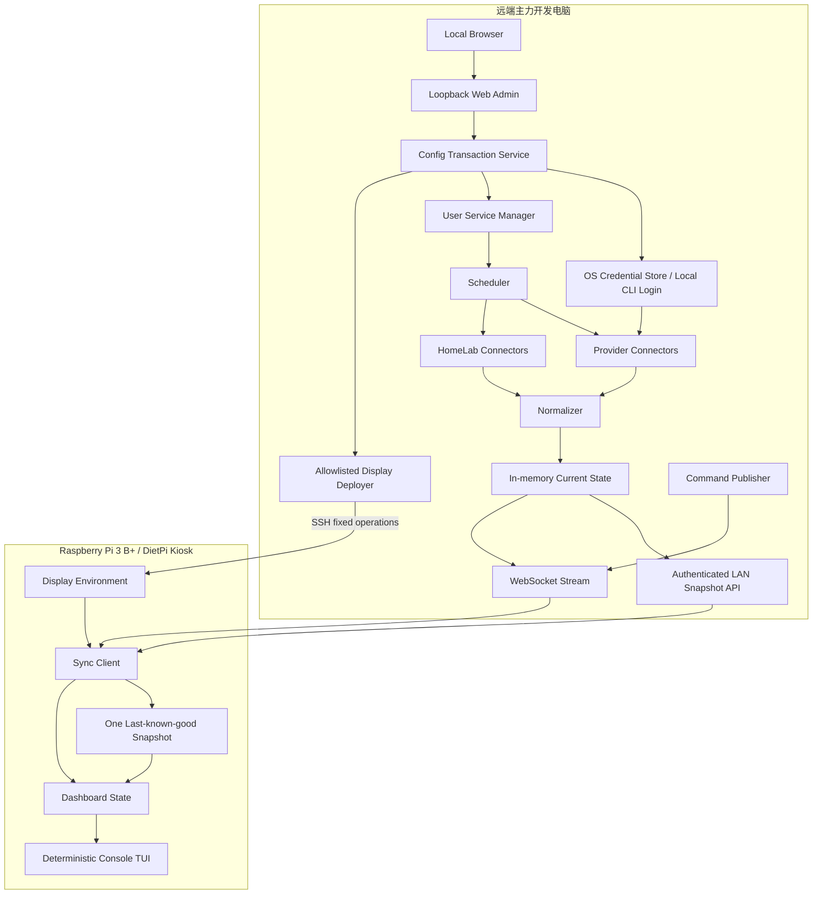

# HomePi Monitor 高层规格

> 规格 ID：HL-001  
> 版本：0.9
> 日期：2026-08-11
> 状态：已认证

## 1. 系统目标

Phase 1 系统由一台远端主力开发电脑 daemon 和一台 Raspberry Pi 3 Model B+ Kiosk 展示节点组成。`homepi-node` 以当前用户身份运行在 macOS、Windows 或 Linux，仅只读访问第三方 API、系统凭据库和既有 CLI 登录态，再分发脱敏的当前指标快照；登录、登出、Token 刷新和账号切换完全交给官方 CLI。Phase 2 在远端主机增加仅监听 loopback 的 Web Admin，将 Provider、系统凭据引用、服务应用和 Display 部署收敛为可校验、可回滚的配置事务。Raspberry Pi 不访问远端文件系统或 Provider 凭据，只负责安全同步、单份最近成功快照、无交互 TUI 展示和受限远程显示命令执行。

## 2. 范围

### 2.1 包含

- Coding Plan、API 余额/成本/Token 使用量采集与标准化。
- 小屏彩色 Linux console TUI、纯 ASCII 降级、单份离线快照、数据新鲜度与阈值状态。
- 远端主机 loopback-only Web Admin、Provider 配置事务和经固定 SSH 操作下发的 Display 配置。
- Prometheus、Grafana、Portainer 状态集成。
- 多页面自动轮播和安全远程显示控制。
- ARMv7 构建、DietPi/systemd 部署与诊断。
- macOS LaunchAgent、Windows PowerShell 用户级后台运行和 Linux `systemd --user` 部署。

### 2.2 不包含

- 任意远程 Shell。
- LAN/公网 Web Admin、Pi 本地设置页面和通用 SSH 命令控制台。
- 网页抓取与 Cookie 自动化。
- 完整 Grafana Web 嵌入。
- 多租户 SaaS 和通用 API Proxy。
- 历史指标、趋势数据库和长期用量分析。

## 3. 组件架构

## 4. 关键设计决策

| ID | 决策 | 理由 |
|---|---|---|
| ADR-001 | 采用远程采集、Pi 展示的双节点架构 | 避免高权限 Key 落在物理暴露且资源有限的 Pi 上 |
| ADR-002 | Go 作为首选实现语言 | ARMv7 官方支持、可交叉编译、部署单一二进制、资源可控 |
| ADR-003 | TUI 使用纯 Go 确定性 console renderer | 目标 Kiosk 无本地输入；固定网格、可控 ANSI、低重绘和最小依赖比交互式框架更符合实机约束 |
| ADR-004 | Pi 主动出站连接远程节点 | 避免开放 Pi 公网入站端口，适配 NAT |
| ADR-005 | 全量快照 + 增量事件 | 首次/重连简单可靠，在线更新开销低 |
| ADR-006 | 指标携带精度和新鲜度 | 防止把估算值或旧值误认为精确实时数据 |
| ADR-007 | 远程命令只允许 UI 动作 | 将控制面风险限制在 Dashboard 内 |
| ADR-008 | Pi 端采用无 stdin 的 Kiosk 模式 | 目标设备不使用触摸或键盘，本地交互不会成为运行依赖 |
| ADR-009 | Codex/Kimi Coding 使用隔离兼容性适配器 | 必须支持参考实现路径，同时明确其非公开稳定 API 风险 |
| ADR-010 | 远端 daemon 采用当前用户上下文的三平台服务 | 只有登录用户上下文才能安全访问本机 CLI 登录态与系统凭据库 |
| ADR-011 | Pi 永不读取或接收 Provider 凭据 | 将认证边界固定在远端主机，降低物理暴露设备的风险 |
| ADR-012 | 不保存历史指标 | 用户只需当前状态；避免时序存储、SD 卡写放大与额外隐私风险 |
| ADR-013 | daemon 永不管理 Provider 登录生命周期 | 避免复制官方 CLI 的 OAuth/刷新逻辑和写回高敏感登录态；认证失效只报告用户操作 |
| ADR-014 | Phase 1 只绑定一台远端 node | 满足当前 Kiosk 使用场景并降低配置、仲裁和 UI 复杂度 |
| ADR-015 | 以 60×20 ASCII 作为布局基线，Linux console 默认启用彩色线框主题 | 匹配实机 480×320/Fixed 8×16；默认用 SGR 色彩与受控 Unicode 字形增强层级，同时保留逐字节 ASCII 降级 |
| ADR-016 | Phase 2 Web Admin 只监听远端主机 loopback，并与 CLI 复用配置事务服务 | 改善配置体验而不新增 LAN/公网管理面；避免 Web 与 CLI 产生两套校验和秘密处理逻辑 |
| ADR-017 | Display 持久配置由远端 Web Admin 经固定允许操作的 SSH 部署器下发 | 复用既有 `ssh dietpi` 管理边界，支持原子替换、重启与回滚，同时禁止任意远程 Shell 输入 |

## 5. 高层数据模型

### 5.1 MetricSnapshot

| 字段 | 类型 | 必需 | 说明 |
|---|---|---:|---|
| schema_version | string | 是 | 消息 schema 版本 |
| source_epoch | UUID | 是 | daemon 每次启动生成的实例世代标识 |
| snapshot_version | uint64 | 是 | 同一 `source_epoch` 内单调递增版本 |
| generated_at | timestamp | 是 | 远程节点生成时间 |
| source_node | string | 是 | 远程节点 ID |
| metrics | array | 是 | ProviderMetric 列表 |
| connector_health | array | 是 | 连接器健康状态 |

### 5.2 ProviderMetric

| 字段 | 类型 | 必需 | 说明 |
|---|---|---:|---|
| id | string | 是 | 稳定唯一 ID |
| provider | string | 是 | openai/kimi/minimax/glm/deepseek/gemini 等 |
| account_label | string | 是 | 用户可读账号别名，不含秘密 |
| metric_kind | enum | 是 | quota/balance/cost/tokens/requests/availability |
| value | decimal | 条件 | 当前值 |
| limit | decimal | 否 | 上限；未知时为空 |
| unit | string | 是 | percent/USD/CNY/tokens/requests/boolean 等 |
| window | enum | 是 | rolling_5h/daily/weekly/monthly/billing_cycle/prepaid/instant |
| resets_at | timestamp | 否 | 可获知时提供 |
| observed_at | timestamp | 是 | 数据观察时间 |
| precision | enum | 是 | exact/verified/estimated/manual/unavailable |
| source_kind | enum | 是 | official_api/official_cli/official_export/manual/compatibility_api |
| status | enum | 是 | ok/warning/critical/unknown/error/stale |
| message | string | 否 | 安全、可展示的说明 |

### 5.3 DisplayCommand

| 字段 | 类型 | 必需 | 说明 |
|---|---|---:|---|
| command_id | UUID | 是 | 幂等键 |
| device_id | string | 是 | 目标 Pi |
| kind | enum | 是 | 允许列表动作 |
| params | object | 是 | 按 kind 校验 |
| issued_at | timestamp | 是 | 创建时间 |
| expires_at | timestamp | 是 | 过期时间 |
| priority | enum | 是 | normal/high/emergency |

## 6. 接口规格

### 6.1 快照接口

- `GET /v1/devices/{device_id}/snapshot`
- 认证：设备作用域 Bearer token 或 mTLS。
- 默认由 daemon 直接终止 TLS；仅显式开发模式允许 loopback 明文 HTTP。配置自有证书时必须
  同时提供证书与私钥路径，服务不得静默改用自动生成证书。
- 返回：最新完整 MetricSnapshot。
- 支持 `ETag`/版本号，未变化时返回 304。

### 6.2 事件流

- `GET /v1/devices/{device_id}/stream` 升级为 WebSocket。
- 消息类型：`snapshot_delta`、`connector_health`、`display_command`、`heartbeat`。
- 客户端消息：`hello`、`ack`、`command_result`、`device_health`。
- daemon 尚未完成第一次成功指标采集时只维持连接和心跳，不发送可持久化的空快照。
- 心跳超时后客户端断开并以带抖动的指数退避重连。
- 收到有效快照或心跳后，该健康会话结束时的重连退避从首次失败重新计算。

### 6.3 兼容性

- 所有消息带 schema version。
- 客户端忽略未知可选字段；不支持的主版本必须拒绝并显示升级提示。
- 同一 `source_epoch` 内快照版本只能前进，较旧版本丢弃并记录诊断事件；新的 epoch 允许版本从零重新开始。

### 6.4 本地 Web Admin

- Web Admin 只监听 `127.0.0.1`/`::1`，不得复用 daemon 的 LAN 快照监听地址。
- 浏览器 API 只处理脱敏状态、配置草稿、只读 Provider 测试和显式 Apply；不提供稳定的外部管理 API。
- Provider 草稿必须先完成字段与 SSRF 校验；候选秘密只存在于密码输入和内存 overlay，测试成功前不写系统凭据库。
- Apply 必须按“验证草稿 → 提交版本化秘密引用 → 原子保存非秘密配置 → 重启服务 → 等待健康 → 清理旧秘密”执行；失败时补偿回滚。
- Display Apply 只允许读取脱敏状态、写固定临时环境文件、校验、原子替换、重启固定 unit、读取有限状态和回滚；不得接受用户提供的任意远程命令。

## 7. 状态与新鲜度规则

- `live`：在该指标配置的目标新鲜度内。
- `delayed`：上游按设计延迟，例如 Cloud Billing。
- `stale`：超过 `stale_after`，仍展示最后值并附时间。
- `error`：当前采集失败，当前内存状态或最近成功快照有旧值时展示旧值；否则显示 `—`。
- `unavailable`：数据源没有稳定查询能力，不进行自动重试风暴。

连接器失败时，daemon 必须把分类错误附加到该连接器最近成功的指标上：旧值继续展示，但
认证失败立即显示 `AUTH`，网络/超时立即显示 `STALE`，schema 或上游错误立即显示 `ERROR`。
`connector_health` 不能作为唯一错误载体。

告警计算先检查 precision 和 freshness，再检查数值。`estimated` 与 `manual` 默认最高只能产生 warning。

## 8. 部署拓扑

### 8.1 默认同一局域网

- `homepi-node` 监听受限 LAN 地址或主机本地反向代理后的 HTTPS。
- Pi 通过用户配置的唯一 daemon DNS/IP 主动连接，不要求自动发现；Phase 1 配置出现第二个活动 node 时启动前报错。
- 防火墙只允许 Pi 到 daemon 端口；Pi 不挂载远端用户目录。

### 8.2 后续跨公网扩展

- 首选 Tailscale/WireGuard 等私网。
- 若必须公网：反向代理 TLS、mTLS/短期设备令牌、速率限制，`homepi-node` 不接受匿名请求。
- Pi 不开放公网控制端口。

## 9. 性能预算

| 项目 | 目标 |
|---|---:|
| Pi Dashboard RSS | ≤120 MB |
| Pi 空闲 CPU | 平均 ≤5% |
| TUI 重绘 | 正常 ≤2 FPS |
| 快照体积 | 目标 ≤256 KB |
| Pi 最近成功快照 | 单文件目标 ≤256 KB |
| 首屏 | 最近成功快照存在时 ≤3 秒 |
| 普通指标同步 | P95 ≤90 秒 |
| 连接器默认并发 | ≤4，可配置 |

## 10. 安全规格

- Provider Key 仅在远端节点存储：macOS 使用 Keychain、Windows 使用 Credential Manager/DPAPI、Linux 使用 Secret Service；受限文件只作为带告警的回退方案。
- Provider Key 不得通过命令行参数传入，只能通过无回显输入、标准输入或受控环境变量进入
  凭据库；文件回退必须使用由完整引用派生的无碰撞文件名。
- Web Admin 不得把 Provider Key、设备 Token、`auth.json` 内容或原始 Provider 响应写入 URL、浏览器持久存储、配置草稿响应、HTTP 访问日志或错误日志；密钥字段永不回填。
- Web Admin 必须校验 Host/Origin、禁用 CORS、使用 SameSite 会话和 CSRF 防护，并以 CSP 禁止外部脚本、字体和网络资源。
- Pi 不读取、挂载、复制或接收远端 `auth.json`、Provider Key、Cookie、Authorization Header 和原始响应。
- 日志使用字段白名单；Authorization/Cookie/Prompt 不进入日志。
- 设备 Token 只允许读取自身快照、连接自身事件流和提交自身 ACK。
- 单设备撤销必须使运行中 daemon 的新请求与既有事件流即时失效；撤销后配置不得继续引用
  已删除凭据，daemon 在零已配对设备时仍须可健康启动并只拒绝设备接口访问。
- DisplayCommand 使用严格 schema 和允许列表，无字符串转 Shell。
- 命令过期、重放、目标不匹配、未知参数均拒绝。
- Pi 最近成功快照采用临时文件、文件 fsync、原子替换和父目录 fsync，权限仅 Dashboard
  服务用户可读写；不创建历史指标表。
- 依赖升级前执行漏洞与许可证检查；构建产物提供校验和。
- `codex_usage` 缺省只读当前用户 `~/.codex/auth.json`，也可配置绝对 `auth_file`；只解析
  `tokens.access_token` 与可选 `tokens.account_id`，不使用 `refresh_token`，不读取 Cookie，
  不执行 OAuth/CLI，不跟随符号链接，不修改登录态文件。
- Provider HTTP 客户端单次响应上限为 1 MiB，拒绝跨主机重定向，不把 URL 查询、响应体、
  Authorization 或 Cookie 写入错误；401/403、429、5xx、超时/网络与 schema 变化必须分类。

## 11. 可观测性

- `homepi-node` 暴露自身 Prometheus 指标：连接器成功率、延迟、最后成功时间、快照版本、在线设备数。
- Dashboard 本地诊断记录：启动原因、屏幕尺寸、最近成功快照加载、重连、命令结果。
- 日志默认 journald，设定速率和容量限制以减少 SD 卡写入。
- 提供 `homepi-mon doctor`，输出脱敏诊断摘要。

## 12. 降级策略

| 故障 | 行为 |
|---|---|
| 启动时无网络 | 立即显示最近成功快照；无快照时显示“等待远端配置/连接”和系统状态 |
| 单连接器 401 | 停止高频重试并进入 `blocked_auth`，提示用户在远端运行官方 CLI；daemon 不登录、不刷新、不写回 |
| 单连接器 429 | 将 Retry-After 作为不可突破的最小等待时间；无该字段时指数退避，显示 rate-limited |
| 远端 daemon 离线 | 保持最后快照，顶栏离线，持续低频重连 |
| 最近成功快照损坏 | 隔离损坏文件，启动空状态，不退出 TUI |
| 终端色彩或 Unicode 不足 | 通过 `HOMEPI_DISPLAY_STYLE=ascii` 降级为无色 7-bit ASCII；状态文本和布局不变 |
| stdin/本地输入不可用 | 不影响 Kiosk；页面由 Phase 3 自动轮播和 Phase 4 远程命令控制 |
| Web Admin 应用失败 | 保留上一份有效配置和秘密引用；服务或 Display 健康确认失败时执行补偿回滚并展示脱敏原因 |
| SSH/Display 应用中断 | Pi 继续使用上一份有效环境文件；临时文件不替换正式配置，必要时自动恢复备份并重启固定 unit |
| 上游 schema 变化 | 连接器进入 error，保存脱敏样本用于修复，不输出错误数值 |

### 12.1 Phase 1 Provider 契约

| 类型 | 请求 | 最小响应白名单 | 标准化输出 |
|---|---|---|---|
| `deepseek_api` | `GET /user/balance` | `is_available`、`balance_infos[].currency/total_balance/granted_balance/topped_up_balance` | 每种币种 3 个独立余额 |
| `kimi_api` | `GET /v1/users/me/balance` | `code/status/data.available_balance/voucher_balance/cash_balance` | 可用、代金券、现金 3 个独立余额 |
| `minimax_coding` | `GET /v1/token_plan/remains`，仅主路径 404 时回退兼容路径 | `base_resp`、`model_remains`、计划名和窗口计数/重置字段 | 5 小时与可用的每周剩余额度 |
| `kimi_coding` | `GET /coding/v1/usages`，仅 404 时回退 `/usage` 一次 | `data` 或 `usage+limits` 的 used/limit/remaining/window/reset 字段 | 5 小时与每周剩余额度 |
| `codex_usage` | `GET https://chatgpt.com/backend-api/wham/usage`，固定 HTTP/1.1 | `plan_type`、`rate_limit.primary_window/secondary_window`；兼容旧 `code_review_rate_limit` 与当前 `additional_rate_limits[].rate_limit` | 5 小时、每周和可识别的可选代码审查剩余额度 |

所有 quota 指标统一把 `value` 表示为剩余量、`limit` 表示总量；上游只给
`used_percent` 时标准化为 `value=100-used_percent`、`limit=100` 并标记 `derived`。

## 13. 模块映射

- Module 001：跨平台远端 daemon、Provider 配置、数据采集与标准化。
- Module 002：Raspberry Pi TUI Dashboard 与单份离线快照。
- Module 003：HomeLab 监控连接器和页面。
- Module 004：远程显示控制、命令验证和 ACK。
- Module 005：loopback Web Admin、Provider 配置事务与 Display 配置部署。
- UI Spec 001：60×20 Linux console 彩色主题、ASCII 降级、状态语言和各阶段页面原型。

## 14. 里程碑门禁

每个里程碑必须同时满足：

1. 对应 Module Spec 与测试文档已更新。
2. Unit Test 和可执行范围内的 E2E Test 已完成。
3. 测试文档记录输入、预期输出、实际输出和结果。
4. 用户可以按 PRD 中的手动验收步骤看到独立产出物。
5. 代码审查无阻断问题。

Phase 1 本轮实机验收配置（2026-08-11）：产品支持范围仍为 macOS、Windows 与 Linux daemon；
产品所有者明确要求当前先以本机 macOS 作为唯一 daemon 主机，连接目标 Raspberry Pi 完成验收。
Windows 与额外 Linux daemon 的真实服务生命周期暂缓补测，不删除对应实现、构建与测试契约，
也不得把交叉编译写成已经完成的实机验证。

供电验收例外（2026-08-11）：产品所有者在看到 `0x50005`、本次启动 7 条欠压事件及收尾
`0xD0000` 后，明确指示忽略供电问题并继续开发。上述事实仍须保留在测试报告中，不得改写为
“无欠压通过”；但本轮不再以 1 小时/24 小时稳定供电结果阻塞 Phase 1 软件交付。

## 15. 实施前输入

- 实机终端报告是否确认附件推断的横屏 60×20、8×16 字体基线。
- LAN 内 TLS 的首版终止方式和设备配对方式。
- Phase 2 使用本机 macOS 浏览器与默认 `ssh dietpi` 完成 Web Admin 和 Display 配置验收；
  Windows/Linux Web Admin 实机按产品所有者要求暂缓，但保留平台接口契约。
- Phase 3 开始前记录现有 Prometheus/Grafana/Portainer 版本与认证方式。
