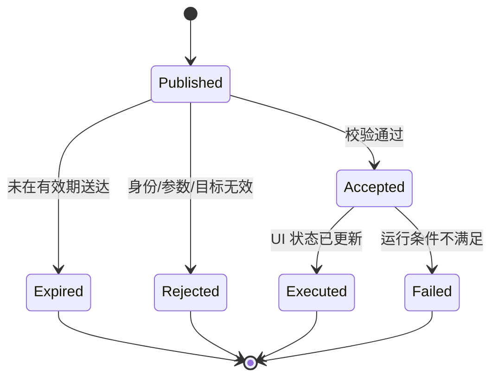

# Module Spec 004：远程控制

> 模块 ID：MOD-004  
> 版本：0.4  
> 状态：已认证

## 1. 模块目标

允许受信任的远端 `homepi-node` 通过 Pi 主动建立的既有 LAN 连接改变 Dashboard 显示状态，同时确保命令可验证、可过期、可幂等、可审计，且能力严格限制在 UI 范围内。

## 2. 允许命令

| kind | 参数 | 行为 | 默认过期 |
|---|---|---|---:|
| show_page | page_id | 切换到指定页面 | 30 秒 |
| next_page | 无 | 下一页 | 30 秒 |
| previous_page | 无 | 上一页 | 30 秒 |
| set_rotation | enabled, interval | 配置页面轮播 | 5 分钟 |
| refresh_data | connector_ids 可选 | 请求远程节点刷新并等待新快照 | 30 秒 |
| show_message | text, severity, duration | 显示受限长度消息 | 30 秒 |
| set_brightness | level | 硬件支持且已配置时调整背光 | 30 秒 |

任何未列出的 kind 均拒绝。`show_message` 只作为文本渲染，不支持 ANSI 控制序列、Markdown、URL 自动打开或命令模板。

## 3. 明确禁止

- 任意 Shell/脚本执行。
- 关机、重启、软件更新、文件上传/下载。
- 修改网络、用户、systemd 或 Provider 凭据。
- 通过消息注入终端转义序列。
- 控制非目标设备。

## 4. 命令生命周期

Pi 必须先发送 Accepted ACK，再在状态更新后发送 Executed/Failed 结果。简单原子 UI 命令可合并两步，但协议仍保留最终状态。

## 5. 校验顺序

1. WebSocket 会话已经通过设备身份认证。
2. 消息 schema 主版本受支持。
3. `device_id` 与当前设备一致。
4. `command_id` 格式正确且未处理过。
5. 当前时间在 issued_at/expires_at 允许范围内，并考虑有限时钟偏差。
6. kind 在允许列表。
7. 参数通过严格类型、枚举、范围和长度校验。
8. 当前硬件/页面能力支持该命令。

任一步失败均返回稳定错误码，不返回内部堆栈或秘密。

## 6. 幂等与顺序

- Pi 保存最近已处理 command ID 的有界集合，重启后仍保留短期记录。
- 重复命令返回原结果，不再次执行。
- 同一设备命令按服务端 sequence 排序；明显旧 sequence 拒绝。
- `show_page` 等状态设置命令天然幂等；`next_page` 依赖 command ID 防重。
- 高优先级命令可越过普通队列，但不能绕过校验。

## 7. 优先级与 UI 仲裁

| 优先级 | 来源 | 行为 |
|---|---|---|
| emergency | 严重告警 | 临时抢占；显示原因和返回提示 |
| high | 远程管理员消息 | 暂停轮播，展示到 duration |
| normal | 远程切页/自动轮播 | 常规显示；设备无本地交互源 |

当临时展示结束时，恢复抢占前页面，不默认跳回固定首页。

## 8. 传输与认证

- 复用 Module 001/002 的认证 WebSocket，不新增 Pi 入站服务。
- 默认在同一局域网内通信；Phase 1 的 Pi 只连接唯一配置并配对过的 `source_node_id` 与地址，其他 node 的命令一律拒绝。
- 服务端只向命令目标设备推送。
- TLS 会话外仍以命令结构中的 target、expiry、sequence 防误路由和重放。
- 若使用共享设备 Token，必须可单设备撤销和轮换；更高安全场景使用 mTLS。

## 9. 审计

记录：command_id、kind、设备、签发时间、接收时间、结果、错误码和耗时。`show_message` 文本默认只记录长度与哈希，不记录完整内容。日志有大小和保留期限制。

## 10. 失败行为

- WebSocket 断线时命令不经其他非安全通道补发；重连后只发送仍未过期的期望状态命令。
- 不支持的 brightness 返回 `unsupported_capability`，不得假成功。
- UI 正忙时命令应快速入队或拒绝，不能阻塞心跳。
- 命令积压超过上限时丢弃最旧的普通命令，保留最新期望状态并报告 overflow。

## 11. 验收标准

- 合法 `show_page` 在正常网络下 1 秒内改变页面并返回 Executed。
- 相同 command_id 重放 10 次只产生一次状态变化。
- 过期、错设备、未知 kind、越界参数和含 ANSI 控制字符的消息全部被拒绝。
- 断网时 Pi 保持当前页或继续 Phase 2 自动轮播；恢复连接后不执行已过期旧命令。
- 端口扫描确认 Pi 无因该模块新增的公网入站监听。
- 审计日志可关联命令与结果，且不包含 Provider Key 或完整敏感消息。
