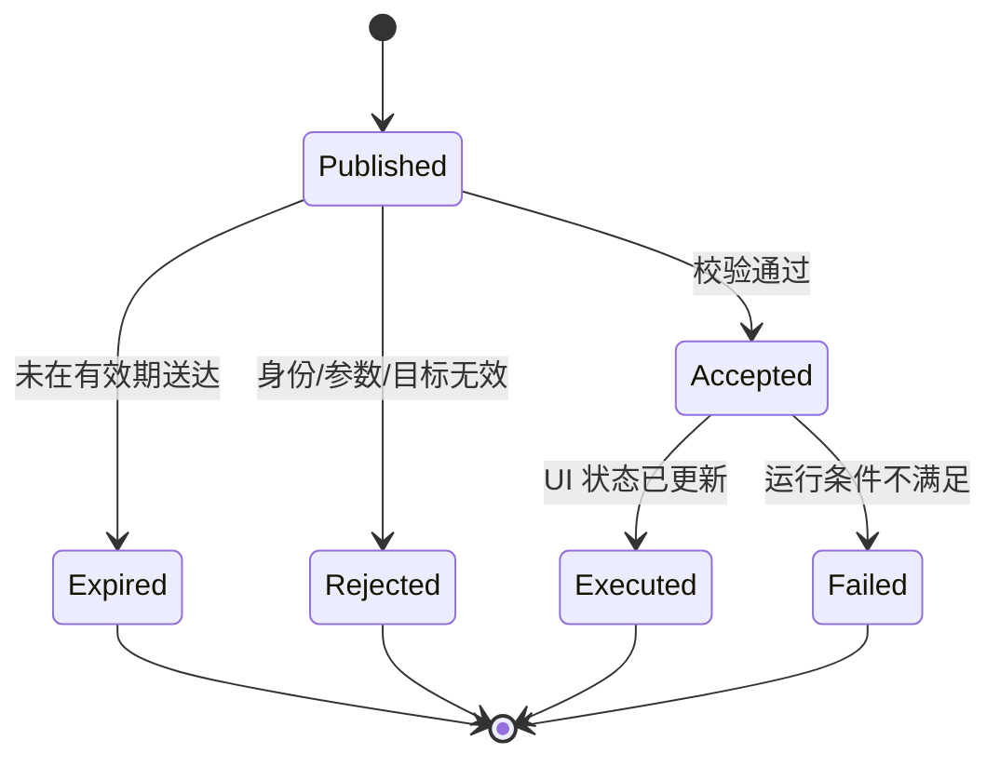

# Module Spec 004：远程控制

> 模块 ID：MOD-004  
> 所属阶段：Phase 4
> 版本：0.5
> 状态：已认证，代码与实机门禁完成，用户验收待确认

## 1. 模块目标

允许管理员从远端主机本机通过受限 `homepi-node remote` 入口发布命令，由 daemon 沿 Pi 主动建立的
既有 LAN 连接改变 Dashboard 显示状态；命令必须可验证、可过期、可幂等、可审计，且能力严格
限制在 UI 范围内。

管理员控制面使用独立的本机凭据和本机来源校验，不复用 Pi 设备 Token；Pi 不新增入站服务。

## 2. 允许命令

| kind | 参数 | 行为 | 默认过期 |
|---|---|---|---:|
| show_page | page_id, duration | 临时切换到指定页面，到期恢复 | 30 秒 |
| next_page | duration | 临时显示下一页，到期恢复 | 30 秒 |
| previous_page | duration | 临时显示上一页，到期恢复 | 30 秒 |
| set_rotation | enabled, interval, duration | 临时覆盖页面轮播 | 5 分钟 |
| refresh_data | connector_ids 可选 | 请求远程节点刷新并等待新快照 | 30 秒 |
| show_message | text, severity, duration | 显示受限长度消息 | 30 秒 |
| set_brightness | level | 硬件支持且已配置时调整背光 | 30 秒 |

任何未列出的 kind 和任何 kind 的未知参数均拒绝。页面只允许 `CODING/API/HOMELAB/SERVICES/SYSTEM`；
页面/消息 duration、轮播 interval 均为 5–300 秒，brightness 为 0–100。`show_message` 只接受最多
116 个 7-bit 可打印字符和 `info|warning|critical`，不支持控制字符、ANSI、Markdown、URL 自动打开
或命令模板。`connector_ids` 最多 16 个且只能引用已配置连接器；空列表表示全部启用连接器。

## 3. 明确禁止

- 任意 Shell/脚本执行。
- 关机、重启、软件更新、文件上传/下载。
- 修改网络、用户、systemd 或 Provider 凭据。
- 通过消息注入终端转义序列。
- 控制非目标设备。

## 4. 命令生命周期

Pi 必须先发送 Accepted ACK，再在状态更新后发送 Executed/Failed 结果。简单原子 UI 命令可合并两步，但协议仍保留最终状态。

管理员 CLI 与 daemon 控制 API 使用小写状态 `published/accepted/executed/rejected/expired/failed`；
每个结果携带稳定错误码、接收/完成时间和耗时，不返回内部堆栈。`refresh_data` 在 Display accepted 后
触发 daemon 即时采集，Display 接收首个更新快照后返回 executed。

## 5. 校验顺序

1. WebSocket 会话已经通过设备身份认证。
2. 消息 schema 主版本受支持。
3. `device_id` 与当前设备一致。
4. `command_id` 是规范 UUID；已处理过时直接返回原结果。
5. 当前时间在 issued_at/expires_at 允许范围内；允许签发时间最多快 30 秒，传输 TTL 最长 5 分钟。
6. sequence 大于持久高水位。
7. kind 在允许列表。
8. 参数通过严格类型、未知字段、枚举、范围、长度和控制字符校验。
9. 当前硬件/页面能力支持该命令。

任一步失败均返回稳定错误码，不返回内部堆栈或秘密。

## 6. 幂等与顺序

- Pi 以原子 rename 保存最近 256 个处理结果与 sequence 高水位，文件 mode 为 `0600`；正常进程/
  service 重启后仍可返回原结果。
- 重复命令返回原结果，不再次执行。
- 同一设备命令按服务端 sequence 排序；明显旧 sequence 拒绝。
- `show_page` 等状态设置命令天然幂等；`next_page` 依赖 command ID 防重。
- daemon 最多保存 64 个待处理命令和 256 个结果；溢出时只淘汰最旧 normal 命令并记录 overflow。
- daemon 与 Pi 均以同目录临时文件和原子 rename 保证正常进程/service 重启可见；为满足 1 秒显示
  时延不逐命令强制 file/directory fsync，因此不承诺突然断电时最后一条命令的 exactly-once。
- 队列始终按 sequence 顺序下发，避免高 sequence 使命令高水位拒绝更早命令；high 消息不受普通
  轮播状态阻塞，队列满时优先保留，但不能绕过校验或淘汰已 accepted 命令。

## 7. 优先级与 UI 仲裁

| 优先级 | 来源 | 行为 |
|---|---|---|
| emergency | Display 本地计算的 CRIT 告警 | 临时抢占；解除后恢复下一层有效状态 |
| high | 远程管理员消息 | 覆盖数据区顶部三行，展示到 duration |
| normal | 远程切页/轮播覆盖 | 冻结自动轮播，覆盖到期后恢复原页面与剩余 dwell |

当临时展示结束时，恢复抢占前页面，不默认跳回固定首页。

## 8. 传输与认证

- 管理员通过 `homepi-node remote` 或本机 loopback Web Admin 后端访问 daemon 的本机控制接口；该接口要求请求来自本机且使用
  secret store 中独立的 `keyring:homepi-remote-control` 随机凭据，不支持 CORS 或浏览器来源。Web Admin
  浏览器永远不接触该凭据，后端只映射固定 UI 操作到协议请求。
- 复用 Module 001/002 的认证 WebSocket 下发，不新增 Pi 入站服务。
- 默认在同一局域网内通信；Phase 1 的 Pi 只连接唯一配置并配对过的 `source_node_id` 与地址，其他 node 的命令一律拒绝。
- 服务端只向命令目标设备推送。
- TLS 会话外仍以命令结构中的 target、expiry、sequence 防误路由和重放。
- 设备 Token 只授权其自身 snapshot/stream 和接收本设备命令，不授权发布命令；必须可单设备撤销和轮换。

## 9. 审计

daemon 和 Pi 记录：command_id、kind、设备、sequence、签发时间、接收时间、结果、错误码和耗时。
`show_message` 只记录长度与 SHA-256 哈希，不记录完整内容。daemon 原子状态/审计与 Pi 幂等记录均
有界；journald 继续使用既有速率与容量限制。

## 10. 失败行为

- WebSocket 断线时命令不经其他非安全通道补发；重连或 daemon 重启后只发送持久队列中仍未过期、
  尚无最终结果的命令。
- 不支持的 brightness 返回 `unsupported_capability`，不得假成功。
- UI 正忙时命令应快速入队或拒绝，不能阻塞心跳。
- 命令积压超过上限时丢弃最旧的普通命令，保留最新期望状态并报告 overflow。

## 11. 验收标准

- 合法 `show_page` 在正常网络下 1 秒内改变页面并返回 Executed。
- 相同 command_id 重放 10 次只产生一次状态变化。
- 过期、错设备、未知 kind、越界参数和含 ANSI 控制字符的消息全部被拒绝。
- 断网时 Pi 保持当前页或继续 Phase 3 自动轮播；恢复连接后不执行已过期旧命令。
- 端口扫描确认 Pi 无因该模块新增的公网入站监听。
- 审计日志可关联命令与结果，且不包含 Provider Key 或完整敏感消息。
