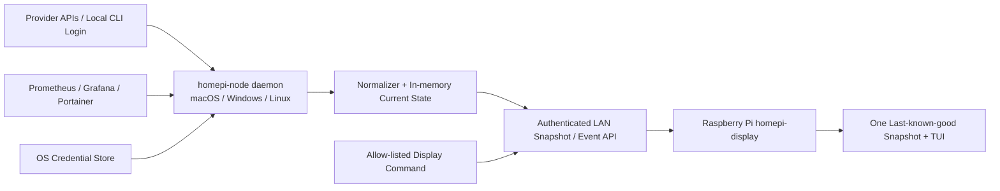

# HomePi Monitor 产品需求文档

> 版本：0.6
> 日期：2026-08-11
> 状态：已认证  
> 目标硬件：Raspberry Pi 3 Model B+ + DietPi + 3.5inch RPi Display（480×320）

## 1. 产品摘要

HomePi Monitor 是一个面向个人开发者和 HomeLab 管理者的常驻小屏 Dashboard。系统将 Coding Agent 订阅余量、模型 API 使用/余额与 HomeLab 运行状态汇总到 Raspberry Pi 3 上，以开机即显示、断网可读、低资源占用的 TUI 形式呈现，并允许受信任的远程节点切换显示页面。

产品的首要原则不是“显示尽可能多的数据”，而是“明确显示数据的含义、来源、精度和新鲜度”。订阅配额、API 余额、Token 用量和成本是不同指标，不得混为一个百分比。

## 2. 背景与问题

Coding Agent 与模型 API 分散在多个平台，配额窗口、计费单位和查询能力各不相同。用户需要频繁打开网页或运行命令确认余量，HomeLab 状态又分散在 Prometheus、Grafana、Portainer 等系统中。

本产品解决以下问题：

1. 用户无法在一个常驻界面快速判断哪个 Coding Agent 即将触顶。
2. API 余额、成本和 Token 用量缺乏统一但不失真的展示。
3. Raspberry Pi 3 和 SPI 小屏资源有限，不适合运行重型浏览器 Dashboard。
4. 断网、远程节点离线或上游接口异常时，现有 Dashboard 容易显示空白或旧数据却不告知用户。
5. 用户希望从远程节点控制树莓派展示内容，但不希望把树莓派直接暴露到公网。
6. Provider、Keychain、daemon 重启和 Pi 环境文件分散在多条命令中；一次配置变更需要操作者手工编排、验证和回滚，容易出现“已保存但未生效”或 mock 覆盖真实数据。

## 3. 目标用户

### 3.1 核心用户

- 同时使用多个 Coding Agent 订阅的个人开发者。
- 使用多家模型 API Key 的开发者或小型团队管理员。
- 管理家庭服务器、容器和监控服务的 HomeLab 用户。

### 3.2 核心使用场景

- 编码过程中抬眼查看 Codex、Kimi Coding Plan、MiniMax Coding Plan 的可用状态。
- 在 API 余额不足或滚动配额接近上限前获得颜色提示。
- 查看 HomeLab 是否在线、CPU/内存/磁盘是否异常、容器是否健康。
- 从远程节点将树莓派切换到指定页面或聚焦某一告警。
- 在主力开发电脑的本地浏览器中添加、测试和应用 Provider，并配置已配对的 Display，无需手工编辑 JSON、环境文件或组合服务命令。

## 4. 产品目标与非目标

### 4.1 目标

- DietPi 启动后自动进入全屏 TUI，无需桌面环境或浏览器。
- 以无触摸、无键盘交互的 Kiosk 方式持续运行。
- 在 480×320 级别的小屏上提供一眼可读的现代界面。
- 统一接入多种数据源，同时保留原始语义、来源、精度与更新时间。
- 网络中断时显示最后一次成功快照，并明确标记陈旧状态；不保存历史指标序列。
- macOS、Windows 和 Linux 主力开发电脑均可运行用户级 `homepi-node` 后台 daemon。
- Provider 登录态和 API Token 只由远端 daemon 在本机读取；树莓派不读取、不挂载也不接收远端 `auth.json` 或 Provider 密钥。
- 登录、登出、Token 刷新和账号切换完全由 Provider 官方 CLI 负责；daemon 不执行任何登录生命周期操作，也不修改登录态文件。
- Phase 1 只绑定并展示一台主力开发电脑。
- 默认所有设备位于同一局域网，树莓派主动连接已配置的远端 daemon。
- Phase 2、Phase 3、Phase 4 可在 Phase 1 架构上增量演进，无需推翻部署方式。

### 4.2 非目标

- 不在 Phase 1 构建通用 API 网关或代理所有模型请求。
- 不通过网页抓取、复用浏览器 Cookie 或逆向私有接口来承诺稳定配额查询。
- 不把 Grafana Web 页面缩放后嵌入 3.5 英寸屏幕。
- 不允许远程控制执行任意 Shell 命令。
- 不在首版支持多租户、复杂 RBAC 或公网 SaaS。
- 不把 Web Admin 暴露到 LAN/公网，不在 Pi 上提供设置页面或通用 SSH 命令控制台。
- 不以秒级刷新成本/账单；上游账单数据的延迟必须如实展示。

## 5. 关键产品原则

### 5.1 指标不失真

每个指标必须携带：来源、指标类型、单位、统计窗口、观察时间、预计重置时间、精度等级和健康状态。若上游只提供余额，就显示余额；不得凭空换算为“套餐剩余百分比”。

### 5.2 连接器能力分级

| 等级 | 数据来源 | 展示标签 | 产品承诺 |
|---|---|---|---|
| A | 官方公开 API | 精确 | 可用于阈值与告警 |
| B | 官方 CLI、官方插件或官方导出 | 已验证 | 版本变化时可能需要更新适配器 |
| C | 本地请求/响应日志累计 | 估算 | 只覆盖经过该节点的调用，可与账单对账 |
| D | 手工配置或仅可用性探测 | 手工/状态 | 不承诺实时余量 |
| X | 无合规稳定来源 | 不可用 | 明确说明原因，不抓取网页 |

### 5.3 离线优先

树莓派应在远程节点离线后继续显示唯一一份最近成功快照；每张卡片独立标记“实时、延迟、陈旧、不可用”，而不是全屏报错。该快照仅用于离线启动和故障降级，不构成历史指标库。

### 5.4 默认安全

高权限 Admin Key、API Key、Provider 登录态和服务令牌只存在远程节点。树莓派不保存 Provider 密钥、`auth.json` 或浏览器 Cookie，不对公网监听控制端口，所有控制指令必须在允许列表中。

## 6. 数据源可行性矩阵

| 对象 | MVP 可行路径 | 能力等级 | 备注 |
|---|---|---:|---|
| MiniMax Coding Plan | 官方 Token Plan API + 参考项目的 Coding Plan 路径兼容 | A/B | 真实账号契约测试确定主路径；5 小时滚动窗口 |
| Codex Usage | `homepi-node` 在远端本机读取既有 Codex 登录态并查询 `wham/usage`，只发送标准化指标 | B | 社区逆向兼容接口，必须有契约测试；Pi 不接触 `auth.json`，不使用网页 Cookie |
| Kimi Coding Plan | `api.kimi.com/coding/v1/usages`，404 回退 `/usage` | B | 参考实现已接通，但非公开稳定 API；使用专用 `sk-kimi-*` Key |
| DeepSeek API | 官方 `/user/balance` | A | 显示总余额、赠金和充值余额 |
| Kimi API | 官方 `/v1/users/me/balance` | A | 显示 available、voucher 和 cash balance；与 Coding Plan 分开 |

Phase 1 只交付以上五类连接器。OpenAI API、GLM、Gemini 和其他 Provider 留在后续候选池，不进入 Phase 1 验收。

## 7. 总体用户体验

### 7.1 启动体验

1. DietPi 完成 CLI 启动。
2. HomePi Monitor 自动启动并立即读取本地最后快照。
3. 屏幕在 3 秒内显示内容，即使网络尚未就绪。
4. 后台连接远程节点并逐卡更新。
5. 顶部状态栏显示连接状态、最近同步时间和当前页面。

### 7.2 Phase 1 单页信息架构

- 顶栏：产品名、远程节点状态、当前时间。
- 订阅区：最多 4 张重点卡，显示剩余/已用、窗口与重置倒计时。
- API 区：最多 4 张余额/成本卡，显示币种、今日/本月用量或余额。
- 底栏：数据新鲜度、告警数量、Kiosk/离线状态和版本。
- 卡片状态色：正常、注意、严重、未知；颜色之外同时使用符号，保证灰度可读。

### 7.3 Phase 2 本地 Web Admin

- 在远端主机本地浏览器展示 node、Provider 和 Display 的脱敏状态。
- Provider 以卡片管理，支持草稿编辑、只读测试、凭据轮换、启停、批量应用和失败回滚。
- Display 页面自动推导 source node、证书指纹和设备凭据引用，通过固定允许操作的 SSH 部署流程应用到 `dietpi`。
- 用户只需要执行一次 `homepi-node configure` 或使用本机快捷入口；正常配置不要求编辑 JSON、环境文件或手工重启服务。
- CLI 保留为自动化、救援和高级诊断入口，与 Web Admin 复用同一校验和配置事务。

### 7.4 Phase 3 页面

1. Coding Plans：订阅配额与滚动窗口。
2. API Spend：Provider 当前返回的余额、当日/当月累计成本或 Token 用量；Dashboard 本身不保存趋势。
3. HomeLab：节点在线、CPU、内存、磁盘、网络。
4. Services：Prometheus、Grafana、Portainer、容器与告警状态。
5. System：树莓派自身温度、资源、连接器健康和版本。

Phase 3 页面按配置自动轮播；Phase 4 才允许远程节点跳转指定页面。设备不提供本地触摸或键盘导航。

## 8. 功能需求

### 8.1 Phase 1：Coding 使用量 Dashboard

#### P1-FR-001 远端节点 daemon

- 主力开发电脑运行用户级常驻 `homepi-node` daemon，必须支持 macOS、Windows 和 Linux。
- daemon 支持按连接器配置独立轮询周期、超时和退避。
- 单个连接器失败不得阻断其他连接器。
- 连接器输出统一指标结构，同时保留原始错误码供诊断。
- daemon 只在本机读取该用户已有的 CLI 登录态或系统凭据；不得向 Pi 发送 Token、Cookie、Authorization Header、`auth.json` 内容或原始 Provider 响应。
- daemon 不得调用登录、登出、设备授权或 Token 刷新流程，不得写回 CLI 登录态；认证过期时进入 `blocked_auth` 并提示用户在远端运行对应官方 CLI 完成登录。

#### P1-FR-002 指标标准化

- 支持 quota、balance、cost、tokens、requests、availability 六类指标；balance/cost 对外返回和展示固定两位小数。
- 支持 rolling-5h、daily、weekly、monthly、billing-cycle、prepaid 等窗口。
- 支持 exact、verified、estimated、manual、unavailable 五种精度状态。
- 每个指标必须包含 `observed_at`，可用时包含 `resets_at`。

#### P1-FR-003 远程到树莓派同步

- 树莓派主动建立出站连接，不要求公网入站端口。
- 默认在同一局域网内通过已配对的 daemon 地址通信；首版不要求跨公网发现或中继。
- Phase 1 配置只允许一个活动 `source_node_id`；第二个远端 node 必须被配置校验拒绝。
- 首次连接获取完整快照；随后接受增量更新。
- 断线使用指数退避重连，并原子保存唯一一份最近成功快照。
- 同步数据包含 daemon 实例标识和实例内单调递增版本号，防止旧更新覆盖新数据并正确处理 daemon 重启。

#### P1-FR-004 TUI 展示

- 兼容 480×320 级别分辨率与低刷新 SPI 屏。
- 产品界面以独立的 `UI-Spec-001-ASCII-Design.md` 为视觉基线；默认严格适配 60×20 并只依赖 7-bit ASCII。
- 不依赖 X11、Wayland 或 Chromium。
- 默认不使用连续动画；仅在数据变化或固定低频心跳时重绘。
- 支持 ASCII/Unicode 降级与 16/256 色降级。
- 支持横屏为首选布局；竖屏作为后续适配项。

#### P1-FR-005 阈值与状态

- 用户可为百分比、余额和时间窗口设置 warning/critical 阈值。
- 默认建议：剩余 ≤20% 为注意，≤10% 为严重；余额阈值按币种配置。
- 估算/手工数据不能触发“精确告警”，只触发提示级事件。
- 陈旧数据必须覆盖状态色并显示最后更新时间。

#### P1-FR-006 配置与秘密

- Provider 配置必须在远端主力开发电脑完成，提供 `homepi-node provider add/edit/list/test/remove` 等价操作及 Windows PowerShell 使用方式。
- 每个 Provider 账号可配置显示名称、区域（`global`、`cn` 或 `custom`）、Base URL、启用状态、刷新周期和凭据引用；国际站与国内站不得靠代码硬编码切换。
- 非秘密配置使用单一 YAML/TOML 文件并提供示例；`list` 和诊断输出不得回显 Token。
- 秘密优先保存于 macOS Keychain、Windows Credential Manager/DPAPI 或 Linux Secret Service；仅在不可用时允许使用权限为 `0600` 的本地文件并明确告警。
- 配置错误需显示具体连接器和字段，但不得打印 Key。
- `provider test` 只使用现有凭据调用只读用量/余额接口；不得触发登录或 Token 刷新。

#### P1-FR-007 Kiosk 安装与运行

- 提供 ARMv7 二进制、systemd unit 和 DietPi 自启动步骤。
- 应用不依赖 stdin；无键盘或触摸输入时完整运行。
- TUI 异常退出后由 systemd 带退避自动恢复，且回到默认总览页。
- 远端 daemon 分别提供 macOS LaunchAgent、Windows 当前用户后台任务/服务安装脚本和 Linux `systemd --user` unit；进程必须运行在拥有本机登录态的用户上下文中。
- 升级失败时可回退到前一版本二进制。

### 8.2 Phase 2：本地 Web Admin 与配置编排

#### P2-FR-001 Loopback Web Admin

- `homepi-node configure` 启动只监听 `127.0.0.1`/`::1` 的本地管理页，不得绑定 daemon 的 LAN 地址。
- 页面展示 node、Provider、LaunchAgent 和已配对 Display 的脱敏状态；不得返回密钥、设备 Token、`auth.json` 内容或原始 Provider 响应。
- Web 与 CLI 必须复用同一配置、校验、秘密存储和服务管理层。
- 使用 Host/Origin 校验、SameSite 会话、CSRF 防护、CSP 和禁用 CORS；前端资源全部嵌入二进制，不依赖 CDN。

#### P2-FR-002 Provider 配置事务

- 支持 Provider 添加、编辑、启停、删除、只读测试和 API Key 轮换；普通界面不要求用户输入 `secret_ref`。
- 表单按 Provider 类型展示账号别名、区域、Base URL、采集周期、`stale_after`、Codex `auth_file` 或秘密输入。
- 候选秘密在测试成功前只存在于内存 overlay；Apply 使用版本化凭据引用，成功后清理旧秘密，失败时恢复上一份配置与引用。
- Apply 自动完成配置校验、mock/真实指标冲突检查、原子保存、daemon 重启、Provider 首次健康确认和 Pi 新快照确认。
- Provider 登录、登出、OAuth、Token 刷新与账号切换仍由官方 CLI 完成，Web Admin 只显示脱敏恢复提示。

#### P2-FR-003 Display 配置部署

- Display 页面管理 `node_url`、`device_id`、`source_node_id`、证书指纹、数据目录和 `rich|ascii` 主题；可从 node 配置、证书和设备凭据引用自动推导的字段默认只读。
- 通过系统 SSH host key 校验连接已配置的 `dietpi`；后台只执行固定允许的读取状态、写临时环境文件、校验、原子替换、重启固定 unit 和回滚操作。
- 设备 Token 通过 SSH 标准输入进入 Pi 的 `0600` 环境文件，不出现在 argv、URL、浏览器响应或日志。
- 新增 `homepi-display config validate`，在不占用 TTY、不启动 Kiosk 的前提下校验候选环境。

#### P2-FR-004 应用、健康与回滚

- UI 必须明确区分“磁盘配置”“运行中配置”和“Pi 当前快照”，避免只凭进程 running 判断已生效。
- daemon Apply 失败时恢复上一份配置和秘密引用；Display Apply 失败时保留或恢复上一份环境文件并重启固定 unit。
- 最终结果至少展示 daemon 运行状态、启用 Provider 健康、Display WebSocket 状态、最新快照时间和脱敏错误分类。
- 本阶段实机范围为当前 macOS 主机与目标 DietPi；Windows/Linux 保留等价接口与测试设计，实机按产品所有者要求暂缓。

### 8.3 Phase 3：多页面与 HomeLab

#### P3-FR-001 页面轮播

- 支持按配置的页面顺序和停留时间自动轮播。
- 告警抢占结束后恢复原轮播位置。
- 重启后回到默认总览页，再按配置开始轮播。
- Phase 3 不要求本地输入或远程人工切页；远程指定页属于 Phase 4。

#### P3-FR-002 Prometheus

- 使用预定义并可配置的 PromQL 即时查询获取节点与服务指标。
- 默认指标：`up`、CPU、内存、磁盘使用率、网络吞吐和活跃告警数。
- 禁止在小屏端执行开放式高基数查询。

#### P3-FR-003 Grafana

- 检查实例健康、版本和告警摘要。
- 使用最小权限 service account token。
- 不在小屏嵌入完整 Grafana Dashboard。

#### P3-FR-004 Portainer

- 显示 Portainer 健康、环境数量、运行/停止容器数和失败状态。
- 针对 `/system/status` 与旧版本 API 做能力探测。
- 使用只读访问令牌。

### 8.4 Phase 4：远程显示控制

#### P4-FR-001 命令模型

- 管理员只从远端主机本机使用 `homepi-node remote` 发令；控制凭据与 Pi 设备 Token 分离，浏览器、
  LAN 其他主机和 Pi 均不能发布命令。
- 仅支持允许列表命令：`show_page`、`next_page`、`previous_page`、`set_rotation`、`set_brightness`（硬件支持时）、`refresh_data`、`show_message`。
- 明确禁止任意 Shell、软件安装、重启主机和文件写入命令。

#### P4-FR-002 可靠性与安全

- 命令包含 `command_id`、目标设备、创建时间、过期时间和参数。
- 树莓派校验身份、目标、时效和参数后执行。
- 每个命令返回 accepted/executed/rejected/expired 状态与原因。
- 重复 `command_id` 必须幂等，不重复执行。
- daemon 断线/重启后只重发仍未过期且无最终结果的有界命令；Pi 重启后仍能从有界持久记录识别重放。

#### P4-FR-003 展示优先级

- 严重告警可临时抢占当前页；告警超时或收到远端确认命令后返回前页。
- 远程消息有最长展示时间，过期自动恢复。
- 优先级为紧急告警、有效远程覆盖、自动轮播；设备不存在本地交互优先级。

## 9. 非功能需求

### 9.1 性能

- Raspberry Pi 3 稳态 RSS 目标 ≤120 MB。
- 空闲 CPU 平均目标 ≤5%，同步或重绘瞬时允许更高但不持续。
- TUI 正常重绘频率 ≤2 FPS；SPI 屏默认仅变化时刷新。
- 最近成功快照存在时，读取后 3 秒内出现首屏。
- 远程节点可用时，普通指标端到端陈旧度目标 ≤90 秒；明确为账单延迟的数据除外。

### 9.2 可靠性

- 远程节点离线 24 小时仍可启动并显示最后快照。
- 单连接器失败不影响进程或其他卡片。
- 非法/损坏快照不得导致 TUI 崩溃。
- systemd 自动重启需带退避，避免崩溃循环刷写 SD 卡。

### 9.3 安全与隐私

- 传输使用 TLS；跨公网推荐 WireGuard/Tailscale 类私网或 mTLS。
- 树莓派设备令牌仅允许读取指标和接收本设备命令。
- 高权限 API Key 不下发到树莓派。
- 日志不记录完整 Key、Authorization Header、Cookie 或原始 Prompt 内容。
- 远程指令保留本地审计日志并限制大小。

### 9.4 可维护性

- 连接器采用稳定接口独立实现，版本和能力可查询。
- 所有外部响应先保存必要的原始语义，再映射为统一指标。
- 配置文件具有 schema version，并提供迁移策略。
- 诊断命令能输出版本、屏幕尺寸、连接状态和连接器健康，但不泄露秘密。

### 9.5 可读性

- 不只依赖颜色区分状态。
- 关键数值使用大字号终端字体和短标签。
- 在固定 480×320 分辨率下不依赖滚动查看 Phase 1 关键指标。
- Kiosk 页面不显示无效的按键或触摸操作提示。

## 10. 建议系统架构

建议技术栈：

- 远端 `homepi-node`：Go，连接器、调度、当前状态内存模型、HTTPS/WebSocket 服务与跨平台用户级 daemon。
- 树莓派 Dashboard：Go + Bubble Tea + Lip Gloss，ARMv7 静态/最小动态依赖二进制。
- 配置：远端 TOML/YAML 保存非秘密 Provider 配置；秘密写入各操作系统凭据库。
- 本地存储：不使用时序库或 SQLite 指标表；远端指标只驻留内存，Pi 仅以原子替换方式保存一份最近成功 JSON 快照。
- 进程管理：macOS LaunchAgent、Windows 当前用户后台任务/服务、Linux `systemd --user`；Pi 使用 systemd 与 `dietpi-autostart` 启动前台 TUI。
- 网络：默认同一 LAN；Phase 1 的 Pi 主动连接唯一一个已配置 daemon。消息仍携带来源 ID 以便诊断，但首版不实现多节点聚合或切换。

## 11. 里程碑与手动验收产物

### M0：硬件与显示基线（已由用户验证）

现状：Raspberry Pi 3 Model B+ 已通过 3.5inch RPi Display（背板标注 RoHS、480×320 Pixel）正常启动并显示 DietPi CLI。

照片推断基线为横屏 60×20 字符、约 8×16 点阵字体；运行时以 `TIOCGWINSZ`/终端报告值为最终依据。照片同时显示反复 `Undervoltage detected!`，因此在进行稳定性测试前必须更换或核验电源、线材并确认内核日志不再出现欠压；不测试触摸。

### M1：端到端垂直切片

产出：macOS、Windows、Linux 上的模拟 `homepi-node` 均可向 Pi 发送同一协议快照；Pi 自动启动并以 Kiosk 方式显示 5 类卡片。

手动验收：修改模拟数据后 90 秒内小屏更新；断开网络后显示旧值和陈旧标记；重启 Pi 后仍显示最近成功快照。

### M2：Phase 1 首批真实连接器

产出：MiniMax Coding Plan、Codex Usage、Kimi Coding Plan、DeepSeek API Balance、Kimi API Balance 五个连接器。

手动验收：逐一与官方控制台/CLI 或 `ai-usage-board` 同账号结果对照；A 级余额金额一致，B 级订阅窗口、使用率和重置时间一致；接口失效时明确显示兼容性错误而不是旧值冒充实时值。

### M3：Phase 1 产品化

产出：三类远端操作系统安装脚本/包、Pi systemd 服务、远端 Provider 配置命令、脱敏日志、离线恢复和阈值提示。

手动验收：在全新 DietPi 镜像按文档安装；分别在 macOS、Windows PowerShell 和 Linux 完成 daemon 配置与自启动；断电恢复；错误 Key、超时、损坏快照均不导致全屏崩溃。

### M4：Phase 2 本地 Web Admin

产出：loopback Web Admin、Provider 配置事务、Keychain 凭据轮换、自动服务应用，以及通过固定 SSH 操作管理 `homepi-display` 参数。

手动验收：在本机浏览器新增并测试 Codex，停用 mock 后一次应用即可让 Pi 收到真实快照；切换 rich/ASCII 后 Display 自动重启并恢复连接；错误 Key、错误环境或 SSH 中断均回滚且不泄露秘密。

### M5：Phase 3 多页与 HomeLab

产出：5 个自动轮播页面，以及 Prometheus/Grafana/Portainer 连接器。

手动验收：切页无明显撕裂；拔掉单个 HomeLab 服务后对应卡片变红且其他页面正常；自动轮播按配置工作。

### M6：Phase 4 远程控制

产出：`homepi-node remote` 本机管理员入口、安全命令通道、允许列表、ACK、断线/重启幂等和脱敏审计。

手动验收：远程切到指定页和显示限时消息；重复命令只执行一次且 Pi 重启后仍不重放；过期/篡改/
未知命令被拒绝；CRIT 抢占后按优先级恢复；Pi 无新增公网或 LAN 入站端口。

## 12. 产品成功指标

- 每日有效展示时长占开机时长 ≥99%。
- 正常网络下普通数据卡片在目标新鲜度内的比例 ≥95%。
- 用户从屏幕识别“哪个配额最紧张”的时间 ≤5 秒。
- 连接器错误不会造成 Dashboard 进程退出。
- Phase 1 完整支持 5 个指定真实数据源：MiniMax Coding Plan、Codex Usage、Kimi Coding Plan、DeepSeek API、Kimi API。
- 关键指标与官方来源抽样对账一致率 100%；估算指标始终带估算标签。

## 13. 风险与缓解

| 风险 | 影响 | 缓解措施 |
|---|---|---|
| 当前设备持续欠压 | SD 卡损坏、随机重启或指标异常 | 将“内核日志无欠压”设为稳定性测试硬门槛；使用足额 5V 电源和低压降线材 |
| 已验证显示配置在系统升级后回归 | Kiosk 无法显示 | 记录当前 DietPi/内核/驱动配置；升级前做屏幕冒烟测试并保留回退镜像 |
| SPI 屏刷新慢 | TUI 撕裂、CPU 高 | 变化驱动刷新、≤2 FPS、禁用动画、减少全屏重绘 |
| Codex/Kimi Coding 使用兼容接口 | 上游变更导致连接器失效 | 固定契约样本、版本监测、独立适配器与 N/A 降级；不抓网页、不使用 Cookie |
| 官方 CLI 登录态过期 | 对应卡片停止更新 | daemon 标记 `blocked_auth` 并给出脱敏操作提示；用户在远端运行官方 CLI 续期后自动恢复采集，daemon 永不代替登录 |
| 上游接口或输出变化 | 连接器失效 | 契约测试、版本探测、独立发布连接器、保留原始错误 |
| 跨平台用户服务差异 | daemon 无法读取正确用户的本机登录态 | 三平台均采用用户上下文运行；分别提供 LaunchAgent、PowerShell 安装和 `systemd --user` 验收 |
| 凭据集中 | 泄露风险 | 使用 macOS Keychain、Windows Credential Manager/DPAPI、Linux Secret Service；日志脱敏；Pi 不保存 Provider 凭据 |
| 本地 Web Admin 被跨站或误绑定到 LAN | 凭据或配置被未授权修改 | 强制 loopback、Host/Origin/CSRF/CSP、禁用 CORS、无外部资源、秘密不回填；启动时拒绝非回环监听 |
| Display SSH 应用中断 | Pi 配置损坏或 Kiosk 离线 | 固定命令允许列表、候选文件先校验、原子替换、保留上一份配置、健康失败自动回滚 |
| SD 卡磨损 | 长期可靠性下降 | 降低日志/写入频率、日志轮转、批量持久化、可选 tmpfs |
| 远程控制被滥用 | 显示劫持或主机风险 | 只允许 UI 命令、签名/令牌、过期时间、幂等和审计 |

## 14. 实施前输入

1. 实机启动后记录终端报告值，核对照片推断的 60×20、8×16 字体基线。
2. Phase 1 基线任务确认 LAN 内 TLS 的首版终止和设备配对参数。
3. Phase 2 使用本机 macOS 浏览器与默认 `ssh dietpi` 验收；确认 Web Admin 只绑定 loopback，Windows/Linux 实机暂缓。
4. Phase 3 开始前记录现有 Prometheus/node_exporter、Grafana 和 Portainer 的版本。

## 15. 资料依据

- [DietPi 系统配置与自动启动](https://dietpi.com/docs/dietpi_tools/system_configuration/)
- [Waveshare RPi LCD 选型指南](https://www.waveshare.com/rpi_lcd_selection_guide)
- [Waveshare 3.5inch RPi LCD (B)](https://www.waveshare.com/wiki/3.5inch_RPi_LCD_%28B%29)
- [OpenAI Usage 与 Costs API](https://platform.openai.com/docs/api-reference/usage/audio_transcriptions_object)
- [Codex 计划与使用限制](https://help.openai.com/en/articles/11369540-codex-and-chatgpt-plan-usage-limits)
- [MiniMax Token Plan 用量查询](https://platform.minimaxi.com/docs/token-plan/faq)
- [Kimi API 余额查询](https://platform.kimi.com/docs/api/balance)
- [Kimi Code 会员用量](https://www.kimi.com/code/docs/en/kimi-code/membership.html)
- [GLM Coding Plan 用量查询插件](https://docs.bigmodel.cn/cn/coding-plan/extension/usage-query-plugin)
- [DeepSeek 余额查询](https://api-docs.deepseek.com/zh-cn/api/get-user-balance)
- [Google Cloud Billing 数据时效](https://docs.cloud.google.com/billing/docs/how-to/export-data-bigquery-tables/standard-usage)
- [Prometheus HTTP API](https://prometheus.io/docs/prometheus/3.5/querying/api/)
- [Grafana HTTP API](https://grafana.com/docs/grafana/latest/developer-resources/api-reference/http_api/)
- [Portainer API](https://docs.portainer.io/api/docs)
- [Go on ARM](https://go.dev/wiki/GoArm)
- [Bubble Tea](https://github.com/charmbracelet/bubbletea)
- [`ai-usage-board` 参考实现](https://github.com/liubaicai/ai-usage-board)
