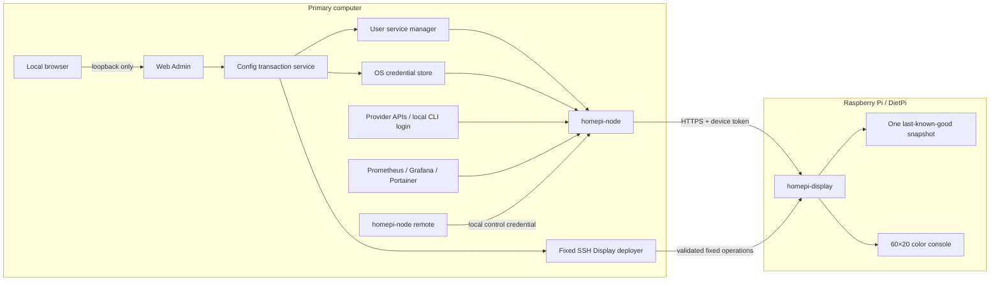

# HomePi Monitor

[English](README.md) | [简体中文](README.zh-CN.md)

HomePi Monitor is a two-node, self-hosted dashboard for showing current AI coding-plan quotas and API balances on a Raspberry Pi kiosk. A user-level daemon, `homepi-node`, runs on your primary computer, reads approved local credentials or provider APIs, normalizes the current metrics, and serves a device-scoped snapshot. A separate output-only program, `homepi-display`, renders that snapshot as a compact 60×20 color console UI on Raspberry Pi / DietPi.

The project also includes a loopback-only Web Admin for managing providers and deploying validated Display settings, five rotating Provider/HomeLab pages, and a local administrator CLI for allowlisted remote display commands.

> [!IMPORTANT]
> HomePi Monitor is under active development. Phase 1 through Phase 4 code and automated gates are implemented. Native Windows/Linux node lifecycle checks, real-account/provider comparisons, real HomeLab service failure tests, and final physical-screen review remain explicit manual acceptance items. See [Development Plan](.vibe/Development-Plan.md) for the authoritative status.

## Table of contents

- [Why HomePi Monitor](#why-homepi-monitor)
- [Features](#features)
- [Architecture](#architecture)
- [Supported providers](#supported-providers)
- [Requirements](#requirements)
- [Quick start with mock data](#quick-start-with-mock-data)
- [Installation](#installation)
- [Initial configuration](#initial-configuration)
- [Web Admin](#web-admin)
- [Provider management from the CLI](#provider-management-from-the-cli)
- [Running `homepi-node` as a service](#running-homepi-node-as-a-service)
- [Pairing and installing the Raspberry Pi display](#pairing-and-installing-the-raspberry-pi-display)
- [Remote display control](#remote-display-control)
- [Configuration and data locations](#configuration-and-data-locations)
- [Development](#development)
- [Build and release](#build-and-release)
- [Security model](#security-model)
- [Troubleshooting](#troubleshooting)
- [Project specifications](#project-specifications)

## Why HomePi Monitor

- Keep provider keys and local CLI login state on the primary computer instead of the physically exposed Pi.
- Show only the latest operational state; the project does not maintain a historical metrics database.
- Continue displaying one last-known-good snapshot when the node or network is temporarily unavailable.
- Use a small, deterministic console renderer suitable for a 480×320 display and a 60×20 terminal.
- Configure providers through a local browser while keeping the management surface off the LAN.
- Deploy two self-contained Go binaries with no browser runtime, CDN, external font, or Node.js dependency.

## Features

- Cross-platform `homepi-node` daemon for macOS, Linux, and Windows user sessions.
- Raspberry Pi ARMv7 kiosk with bright cyan borders and cyan/yellow quota bars.
- Rich Unicode line art by default, with a byte-safe ASCII fallback.
- Current quota, balance, freshness, precision, provider health, and reset-time normalization.
- Authenticated snapshot and WebSocket stream for one or more explicitly paired display devices.
- Automatic self-signed TLS with certificate fingerprint pinning on the display.
- OS credential storage: macOS Keychain, Windows Credential Manager, or Linux Secret Service, with a loud `0600` file fallback.
- Loopback-only Web Admin with provider drafts, read-only tests, diff review, explicit Apply, rollback, CSRF/Origin/Host checks, and service-version drift warnings.
- Fixed-operation SSH Display deployment with candidate validation, atomic replacement, restart health confirmation, and rollback.
- Five configurable rotating pages with bounded Prometheus, Grafana, and Portainer current-state summaries.
- Allowlisted remote page, rotation, refresh, notice, and optional brightness commands over the existing outbound Display stream.
- User-level service integration: LaunchAgent, `systemd --user`, or Windows Scheduled Task.
- Reproducible local builds and a 12-artifact release matrix.

### Current delivery status

| Area | Status | Notes |
|---|---|---|
| Node collection, protocol, TLS, device ACL | Implemented | Native Windows/Linux lifecycle validation remains an explicit acceptance item. |
| Provider connectors | Implemented | Real-account values should still be compared with the provider console before relying on them operationally. |
| Raspberry Pi console kiosk | Implemented | Supports `rich` and `ascii` styles plus one last-known-good snapshot. |
| Provider Web Admin | Implemented, manual acceptance pending | Loopback only; edits providers and applies a validated transaction to the installed node service. |
| Display configuration over SSH | Implemented, manual acceptance pending | Web Admin uses fixed SSH operations, validates the candidate, restarts the fixed unit, confirms health, and rolls back on failure. |
| HomeLab pages and rotation | Implemented, manual acceptance pending | Real Prometheus/Grafana/Portainer service failure checks still require operator-provided endpoints and read-only credentials. |
| Remote display control | Implemented, manual acceptance pending | Local administrator CLI, bounded queue/audit, WebSocket ACK, persistent idempotency, and 60×20 notice rendering are covered automatically. |

## Architecture



The Pi never receives provider keys, `auth.json`, cookies, authorization headers, or raw provider responses. It receives only normalized, device-scoped display data.

## Supported providers

| Provider type | UI label | Credential source | Data path |
|---|---|---|---|
| `codex_usage` | Codex (wham/usage) | Existing Codex CLI `auth.json`, read-only | Compatibility usage endpoint |
| `grok_usage` | Grok Usage | Official Grok CLI `auth.json`, read-only | CLI billing credits endpoint for the consumer weekly subscription quota |
| `minimax_coding` | MiniMax Coding Plan | MiniMax API / subscription key | Token Plan with one bounded legacy fallback |
| `kimi_coding` | Kimi Coding Plan | Kimi Coding API key | Compatibility coding-plan endpoint |
| `deepseek_api` | DeepSeek API | DeepSeek API key | Official balance endpoint |
| `kimi_api` | Kimi (Moonshot) API | Moonshot API key | Official balance endpoint |
| `mock` | Mock Fixture | No credential | Local JSON fixture |
| `prometheus` | Prometheus | Optional read-only bearer token | Bounded instant-query templates |
| `grafana` | Grafana | Read-only service-account token | Health and alert-rule summaries |
| `portainer` | Portainer | Read-only API key | Status, environment, stack, and container summaries |

HomePi does not log in, log out, refresh a token, or switch an account for any provider. Login lifecycle remains the responsibility of each provider's official CLI or console. If an existing login expires, HomePi reports an authentication problem and waits for the operator to repair it through the official tool.

## Requirements

### Primary computer

- Go `1.26.5` or newer, as declared by [`go.mod`](go.mod).
- Git for source checkout and build metadata.
- macOS, Linux, or Windows for `homepi-node`.
- GNU Make and Bash for the repository scripts on macOS/Linux.
- A desktop browser for the Web Admin.
- An accessible OS keyring is recommended. Headless Linux can use the warned `0600` file fallback.

### Raspberry Pi display

- Raspberry Pi 3 Model B+ or another Linux target supported by the release matrix.
- DietPi/Debian with `systemd` for the documented kiosk unit.
- A console configured for at least 60 columns × 20 rows.
- Network access from the Pi to the node's HTTPS listener.
- SSH access for installation and maintenance. SSH is not required at runtime.

### Platform notes

- The Make/shell automation is intended for macOS and Linux.
- Windows binaries and the Scheduled Task integration are implemented, but Windows does not have a native repository install script yet.
- The published build matrix is `darwin/amd64`, `darwin/arm64`, `windows/amd64`, `linux/amd64`, `linux/arm64`, and `linux/arm/v7`.

## Quick start with mock data

This path runs both programs locally, uses the committed fixture, disables TLS only on loopback, and does not touch your normal config or credential store.

```bash
git clone <repository-url>
cd homepi-mon

go mod download
make build
```

Start the mock node in the first terminal:

```bash
make run-node
```

Start the display in a second terminal:

```bash
make run-display
```

The display switches to the terminal's alternate screen. Press `Ctrl-C` to stop it and restore the terminal. Override the development token for both commands when needed:

```bash
export HOMEPI_DEVICE_TOKEN='replace-with-a-local-development-token'
make run-node
# In the second terminal, export the same value before make run-display.
```

`-no-tls` is deliberately restricted to loopback. A real LAN deployment must use HTTPS and certificate pinning.

## Installation

### 1. Build from source on macOS or Linux

```bash
go mod download
make check
make build VERSION=0.1.0

./bin/homepi-node --version
./bin/homepi-display --version
```

The binaries are written to `bin/`. They are development artifacts: `make clean` removes them.

### 2. Install durable local binaries on macOS or Linux

Preview the operation first:

```bash
VERSION=0.1.0 ./scripts/install-local.sh --dry-run
```

Install both binaries to `$HOME/.local/bin`:

```bash
make install-local VERSION=0.1.0
export PATH="$HOME/.local/bin:$PATH"

homepi-node --version
homepi-display --version
```

The installer validates both binaries, replaces them atomically, and keeps one `.previous` copy. If an existing `homepi-node` user service is installed and running, it is restarted and checked; otherwise the installer changes binaries only.

Supported installer options:

```text
scripts/install-local.sh [--install-dir PATH] [--skip-build] [--no-restart] [--dry-run]
```

`make install-local` is a binary installer. It does **not** register the user service for the first time; use `homepi-node install` after creating a valid configuration.

### 3. Build on Windows

Use a regular PowerShell session with Go installed:

```powershell
go mod download
New-Item -ItemType Directory -Force bin | Out-Null
go build -trimpath -o bin/homepi-node.exe ./cmd/homepi-node
go build -trimpath -o bin/homepi-display.exe ./cmd/homepi-display
.\bin\homepi-node.exe --version
```

Before registering the Scheduled Task, copy `homepi-node.exe` to a durable user-owned directory that will not be removed with the source checkout.

## Initial configuration

### 1. Create the config file

```bash
homepi-node config init
homepi-node config show
homepi-node config validate
homepi-node doctor
```

The generated config contains a source node, a loopback HTTPS listener, no devices, and no providers. `config init` refuses to overwrite an existing file.

Default config locations follow the operating system:

| Platform | Default path |
|---|---|
| macOS | `~/Library/Application Support/homepi-node/config.json` |
| Linux | `$XDG_CONFIG_HOME/homepi-node/config.json`, or `~/.config/homepi-node/config.json` when unset |
| Windows | `%AppData%\homepi-node\config.json` |

Set `HOMEPI_NODE_CONFIG` to use a different file. Every config-aware subcommand also accepts an explicit `-config` path where applicable.

### 2. Choose the node listener

The starter config binds `127.0.0.1:8443`. That is safe for local setup but unreachable from a Pi. For a real LAN deployment, edit `listen.addr` to the host's stable private address or LAN interface and keep automatic TLS enabled:

```json
{
  "schema_version": 1,
  "source_node": {
    "id": "dev-mac",
    "label": "DEV-MAC"
  },
  "listen": {
    "addr": "192.168.1.20:8443",
    "tls": {
      "cert": "auto",
      "key": "auto"
    }
  },
  "devices": [],
  "providers": []
}
```

Keep the existing `schema_version`, `devices`, and `providers` fields when editing the full file. Validate after every manual change:

```bash
homepi-node config validate
```

Binding a public interface requires an explicit `allow_public_bind` acknowledgement. Prefer a private LAN, Tailscale, or WireGuard; do not expose the node anonymously to the Internet.

### 3. Install the user service

Run this from the durable installed binary:

```bash
homepi-node install
homepi-node status
```

The service is registered under the current user without root/SYSTEM privileges. macOS and Linux start it during installation; if `status` reports it stopped on any platform, run `homepi-node start`.

## Web Admin

The Web Admin is the recommended provider-management path. It listens only on `127.0.0.1` or `::1`, opens a random port by default, and closes after one hour of HTTP inactivity.

```bash
homepi-node configure
```

For a predictable port or a headless browser workflow:

```bash
homepi-node configure \
  -addr 127.0.0.1:8765 \
  -idle-timeout 30m \
  -no-browser
```

Typical workflow:

1. Open **Providers** and create or edit a provider draft.
2. Enter the provider key only in the password field when the provider requires one.
3. Run the read-only **Test** for new or credential-changing enabled providers.
4. Review the redacted diff.
5. Select **Apply changes** to persist versioned secret references, save the config, restart the installed service, and run its health check.

If Apply fails, the transaction restores the previous configuration and secret set. The page never returns secret values to the browser and never stores them in browser persistence.

The header also compares the Web Admin binary with the binary registered in the user service. If it reports a version or source mismatch, install the current binary before applying new provider types:

```bash
make install-local VERSION=0.1.0
homepi-node status
```

> [!WARNING]
> Apply performs a real restart of the current user's `homepi-node` service. Use the smoke command in [`scripts/smoke-webadmin.sh`](scripts/smoke-webadmin.sh) for isolated UI inspection, and do not click Apply unless you intend to update the configured service.

## Provider management from the CLI

The CLI uses the same config transaction core as the Web Admin. It remains useful for automation and recovery.

List and test providers:

```bash
homepi-node provider list
homepi-node provider test -id codex-main
```

Add Codex usage using the official CLI's existing default `auth.json`:

```bash
homepi-node provider add \
  -id codex-main \
  -type codex_usage \
  -account-label main \
  -region global \
  -interval 5m \
  -stale-after 15m
```

Add the consumer Grok weekly subscription quota using the official CLI's default auth state:

```bash
homepi-node provider add \
  -id grok-main \
  -type grok_usage \
  -account-label main \
  -region global \
  -interval 5m \
  -stale-after 15m
```

The connector reads `~/.grok/auth.json` read-only and actively requests the official CLI billing credits endpoint. It never starts Grok, refreshes tokens, or modifies the auth file. Use `-auth-file` only when the CLI auth state is stored at a different local path; a validated custom region can target a compatible proxy.

Add an API-key provider without putting the key in argv or shell history:

```bash
read -r -s PROVIDER_KEY
printf '\n'
printf '%s' "$PROVIDER_KEY" | homepi-node provider add \
  -id minimax-main \
  -type minimax_coding \
  -account-label main \
  -region global \
  -interval 5m \
  -stale-after 15m \
  -secret-stdin
unset PROVIDER_KEY
```

Add the committed mock fixture:

```bash
homepi-node provider add \
  -id phase1-mock \
  -type mock \
  -account-label demo \
  -interval 5s \
  -stale-after 5m \
  -mock-fixture "$PWD/examples/mock-fixture.json"
```

Edit, disable, or remove a provider:

```bash
homepi-node provider edit -id minimax-main -interval 10m
homepi-node provider edit -id minimax-main -enabled=false
homepi-node provider remove -id minimax-main
```

CLI provider writes persist the config but do not automatically restart the service. Reload it explicitly after a CLI change:

```bash
homepi-node stop
homepi-node start
homepi-node status
```

## Running `homepi-node` as a service

Service lifecycle commands are the same on every supported node platform:

```bash
homepi-node install
homepi-node start
homepi-node stop
homepi-node status
homepi-node uninstall
```

Platform implementation:

| Platform | User-level service |
|---|---|
| macOS | `~/Library/LaunchAgents/com.galendai.homepi-node.plist` |
| Linux | `~/.config/systemd/user/homepi-node.service` |
| Windows | Scheduled Task named `HomePi Monitor` |

Run the daemon in the foreground for diagnostics:

```bash
homepi-node serve -verbose
```

Useful health and diagnostic commands:

```bash
homepi-node config validate
homepi-node doctor
homepi-node status
```

`doctor` prints redacted build, config, secret-backend, certificate-fingerprint, revocation, and provider summaries. It does not print provider keys or device tokens.

## Pairing and installing the Raspberry Pi display

The Web Admin can deploy a paired Display through its fixed SSH transaction after the initial binary/unit installation. The steps below remain the supported manual installation and recovery path.

### 1. Pair a device on the node host

```bash
homepi-node device add -id pi-kiosk
homepi-node device list
homepi-node doctor
```

`device add` prints the plaintext device token exactly once. Store it securely for the Pi environment file. After the node has started with automatic TLS, copy the SHA-256 certificate fingerprint printed by `doctor`.

To revoke a display later:

```bash
homepi-node device revoke -id pi-kiosk
```

### 2. Build the ARMv7 display artifact

```bash
make dist VERSION=0.1.0
make verify-release VERSION=0.1.0
```

The Raspberry Pi 3 artifact is `dist/homepi-display-0.1.0-linux-armv7`.

### 3. Copy the binary to the Pi

Replace the SSH alias when your environment uses a different host:

```bash
scp dist/homepi-display-0.1.0-linux-armv7 dietpi:/tmp/homepi-display
ssh dietpi
```

On the Pi:

```bash
sudo install -m 0755 /tmp/homepi-display /usr/local/bin/homepi-display
sudo useradd --system --user-group --home-dir /var/lib/homepi-display \
  --create-home --shell /usr/sbin/nologin homepi-display
sudo install -d -o homepi-display -g homepi-display -m 0750 /var/lib/homepi-display
sudo install -d -m 0755 /etc/homepi-display

/usr/local/bin/homepi-display service-unit | \
  sudo tee /etc/systemd/system/homepi-display.service >/dev/null
/usr/local/bin/homepi-display environment-example | \
  sudo tee /etc/homepi-display/environment >/dev/null
sudo chmod 0600 /etc/homepi-display/environment
sudoedit /etc/homepi-display/environment
```

If the `homepi-display` user already exists, skip `useradd` and verify its home, group, and ownership before continuing. Fill in:

- `HOMEPI_NODE_URL`: the node's reachable HTTPS URL.
- `HOMEPI_DEVICE_ID`: `pi-kiosk` or the ID created above.
- `HOMEPI_SOURCE_NODE_ID`: the exact `source_node.id` from the node config.
- `HOMEPI_NODE_CERT_PIN`: the fingerprint from `homepi-node doctor`.
- `HOMEPI_DEVICE_TOKEN`: the one-time token printed by `device add`.
- `HOMEPI_DISPLAY_STYLE`: `rich` or `ascii`.

Enable the kiosk:

```bash
sudo systemctl daemon-reload
sudo systemctl enable --now homepi-display.service
sudo systemctl status homepi-display.service
journalctl -u homepi-display.service -n 100 --no-pager
```

The supplied unit binds the program to `tty1`, disables stdin, restarts on failure, and confines writes to `/var/lib/homepi-display`.

### 4. Run the display manually

For a foreground diagnostic session:

```bash
export HOMEPI_NODE_URL='https://192.168.1.20:8443'
export HOMEPI_DEVICE_ID='pi-kiosk'
export HOMEPI_SOURCE_NODE_ID='dev-mac'
export HOMEPI_NODE_CERT_PIN='sha256:replace-with-doctor-fingerprint'
export HOMEPI_DEVICE_TOKEN='replace-with-device-token'
export HOMEPI_DISPLAY_STYLE='rich'

homepi-display run -verbose
```

Use `homepi-display doctor -node-id dev-mac` to inspect the local snapshot without printing the token.

## Remote display control

Phase 4 commands are published only from the node host through `homepi-node remote`. The CLI authenticates with a dedicated credential in the node's secret store; it does not use or reveal the Display device token. Commands travel over the Display's existing outbound authenticated WebSocket, so the Pi does not open a control port.

Examples:

```bash
# Temporarily show API for 30 seconds, then resume the prior rotation position.
homepi-node remote --device pi-kiosk show-page --duration 30s API

# Move relative to the current page without changing the persistent page order.
homepi-node remote --device pi-kiosk next-page --duration 20s
homepi-node remote --device pi-kiosk previous-page --duration 20s

# Temporarily stop rotation, or run every page at a 10-second interval.
homepi-node remote --device pi-kiosk set-rotation --duration 2m off
homepi-node remote --device pi-kiosk set-rotation --interval 10s --duration 2m on

# Trigger one bounded collection for all enabled connectors or selected IDs.
homepi-node remote --device pi-kiosk refresh
homepi-node remote --device pi-kiosk refresh prometheus-main grafana-main

# Overlay a safe three-line notice. Text must be printable ASCII.
homepi-node remote --device pi-kiosk show-message \
  --severity warning --duration 30s 'MAINTENANCE STARTS SOON'
```

`--device` is optional only when exactly one Display is configured. The CLI waits for a final `executed`, `rejected`, `expired`, or `failed` result by default and prints structured JSON. Use global `--wait=false` only when a queued result is sufficient. Delivery TTL defaults to 30 seconds and can be changed with an action-level `--ttl 5s..5m` flag.

`set-brightness 0..100` is allowlisted but succeeds only when the Display build is configured with a supported backlight driver. The standard DietPi build returns `failed/unsupported_capability`; it never reports a brightness change that did not occur.

Priority is fixed: a locally computed CRIT page overrides a remote notice, a notice overrides a remote page/rotation change, and remote state overrides automatic rotation. When an override expires, the previous page and remaining dwell time resume. Remote commands never rewrite `/etc/homepi-display/environment`.

### Recovery and rollback

- If the Display is offline, the daemon retains only bounded, unexpired commands. Expired commands are not delivered after reconnect.
- Repeating a command ID does not repeat the UI action, including after a Display restart; the Pi keeps a bounded `0600` result ledger.
- The node queue and Display ledger use atomic replacement for normal process/service restart recovery. To preserve sub-second UI latency on low-end storage, they do not force every command through file/directory `fsync`; the newest buffered command is not guaranteed exactly once across abrupt power loss.
- To stop a temporary override, wait for its duration or publish a shorter replacement. Persistent page order and dwell remain under the Web Admin Display transaction.
- To roll back the feature build, restore the previously retained `homepi-node` and `homepi-display` binaries and restart their fixed services. Older displays ignore the newer optional stream message; no Pi configuration or listener rollback is required.
- Inspect only redacted metadata with `homepi-node` and Display service logs. Notice audit entries contain message length and SHA-256, not the full text.

## Configuration and data locations

| Data | Default | Override |
|---|---|---|
| Node config | OS user config dir + `homepi-node/config.json` | `HOMEPI_NODE_CONFIG` or `-config` |
| Node runtime data | OS user config dir + `homepi-node/` | `HOMEPI_NODE_DATA_DIR` |
| Secret file fallback | Node data dir + `secrets/` | `HOMEPI_SECRET_DIR` |
| Config transaction data | Node data dir | `HOMEPI_DATA_DIR` |
| Display snapshot | OS user config dir + `homepi-display/` | `HOMEPI_DISPLAY_DATA_DIR` or `-data-dir` |
| Node command queue/result audit | Node runtime data + `commands.json` | `HOMEPI_NODE_DATA_DIR` |
| Display command idempotency | Display data + `command-results.json` | `HOMEPI_DISPLAY_DATA_DIR` or `-data-dir` |

The node data directory contains generated TLS material, the revocation list, logs when installed as a service, and fallback secret files when no OS keyring is available. Do not commit or share it.

## Development

### Repository layout

```text
cmd/homepi-node/           daemon, CLI, service and Web Admin entry points
cmd/homepi-display/        kiosk runtime and terminal lifecycle
internal/configtx/         shared provider/config transaction service
internal/commandbus/       bounded daemon command queue and result audit
internal/connector/        provider adapters and common HTTP policies
internal/nodeapi/          authenticated snapshot and event-stream API
internal/protocol/         wire and metric contracts
internal/remotecontrol/    Display validation, idempotency and UI actions
internal/ui/               deterministic 60×20 renderer and golden files
internal/webadmin/         embedded loopback Web Admin and static assets
internal/install/          platform user-service integrations
internal/kioskunit/        audited DietPi systemd templates
examples/                  mock fixture
scripts/                   build, check, release and install automation
.vibe/                     product, architecture, module and test specifications
```

### Specification-first workflow

Before changing behavior:

1. Read [PRD](.vibe/PRD.md), [High-level specification](.vibe/HL-Spec.md), and the relevant module/test specification.
2. Update the specification and test cases before implementation.
3. Make the smallest scoped code change.
4. Run focused tests, then the full quality gate.
5. Record actual results in the corresponding `.vibe/Test-Module-*.md` document.
6. Ask for user review before committing changes.

Code comments and commit messages are written in English. Project design, development, and test specifications under `.vibe/` are written in Simplified Chinese.

### Common development commands

| Command | Purpose |
|---|---|
| `make check` | Verify formatting, run `go vet ./...`, and run `go test ./...`. |
| `make test` | Run all Go tests. |
| `make vet` | Run Go static analysis. |
| `make fmt` | Rewrite Go files with `gofmt`. Review the resulting diff. |
| `make build` | Build both binaries for the current platform into `bin/`. |
| `make golden` | Regenerate 60×20 UI golden files; visual diff review is required. |
| `make dist` | Cross-build the six-platform release matrix. |
| `make verify-release` | Build, checksum, and verify exactly 12 release artifacts. |
| `make install-local` | Atomically install current-platform binaries to a user directory. |
| `make clean` | Remove repository `bin/` and `dist/` artifacts. |

Run focused or race-enabled tests directly when needed:

```bash
go test ./internal/webadmin ./internal/configtx -count=1
go test -race ./cmd/homepi-node ./internal/webadmin ./internal/configtx -count=1
go test ./internal/ui -count=1
```

Inspect the embedded Web Admin without using the normal port:

```bash
HOMEPI_WEBADMIN_ADDR=127.0.0.1:18765 \
  ./scripts/smoke-webadmin.sh -idle-timeout 10m
```

This smoke process is temporary, but Apply still targets the current user's real service manager. Treat Apply as a state-changing operation.

### Dependency and formatting checks

```bash
go mod verify
gofmt -l cmd internal
go vet ./...
go test ./...
git diff --check
```

Tests must clean up temporary fixtures, certificates, scripts, and runtime files after execution.

## Build and release

Inject a release version into local binaries:

```bash
make build VERSION=1.2.3
./bin/homepi-node --version
```

Build and verify the full release matrix:

```bash
make dist VERSION=1.2.3
make verify-release VERSION=1.2.3
```

The release verifier requires exactly two binaries for each of six targets—12 artifacts total—and creates `dist/SHA256SUMS`. Existing extra artifacts for the same version make verification fail instead of silently entering the release.

Build metadata can be made deterministic for release automation:

```bash
VERSION=1.2.3 \
COMMIT=abc1234 \
BUILD_DATE=2026-08-12T00:00:00Z \
./scripts/build.sh
```

## Security model

- Run `homepi-node` as the logged-in user, never as root or SYSTEM.
- Keep provider credentials on the node host; the Pi receives only normalized display metrics.
- Never pass provider keys through argv. Use the Web Admin password field, `-secret-stdin`, or a controlled environment variable.
- Never commit the node data directory, generated certificates, config variants containing local details, environment files, or device tokens.
- Keep `/etc/homepi-display/environment` owned appropriately and mode `0600`.
- Use HTTPS plus the fingerprint from `homepi-node doctor` for a real LAN display.
- The loopback Web Admin is not a LAN or public management API. Do not place it behind a public reverse proxy.
- Custom provider URLs are validated against private/link-local metadata targets, but operators should still use only trusted HTTPS endpoints.
- Codex `auth.json` is opened read-only, is not followed through a symlink, and is never refreshed or modified by HomePi.
- Grok's local `auth.json` is opened read-only, is not followed through a symlink, and is never sent to the Pi; HomePi does not log in, refresh, or write back the file. Its read-only billing request is limited to the official CLI compatibility endpoint.
- Device revocation removes the configured device, deletes its stored credential, and persists a token hash so a leaked old token remains rejected.
- Remote command publication requires a separate local-only control credential. A Display token cannot publish commands, browser Origins are rejected, and the Pi gains no inbound listener.
- Remote command state is bounded and mode `0600`; completed notices are retained only as length and SHA-256 metadata.

See [HL-Spec security requirements](.vibe/HL-Spec.md#10-安全规格) for the normative contract.

## Troubleshooting

### `no -config file and no -device-id; nothing to serve`

Create the normal config first:

```bash
homepi-node config init
homepi-node config validate
```

The `-device-id`/`-mock-fixture` flags are a legacy mock-development path, not the preferred production configuration.

### Web Admin says the service version is different

The browser is running from one `homepi-node` binary while the service manager points to another. Install the current binary and verify status:

```bash
make install-local VERSION=0.1.0
homepi-node status
```

Do not assume Apply upgrades the service binary; Apply restarts the binary already registered with the service manager.

### Web Admin Apply says the service is not installed

Use a durable binary, validate the config, then register the user service:

```bash
homepi-node config validate
homepi-node install
homepi-node status
```

### A provider needs attention

```bash
homepi-node provider list
homepi-node provider test -id <provider-id>
homepi-node doctor
```

- For `codex_usage`, repair login through the official Codex CLI; HomePi does not refresh it.
- For `grok_usage`, repair or renew login through the official Grok CLI; HomePi does not log in, refresh, or modify `auth.json`.
- For API providers, re-enter the key through Web Admin and run the read-only test before Apply.
- A schema error may mean the upstream provider changed its response. Preserve only a redacted sample when reporting it.
- Respect provider rate limits; do not reduce collection intervals below the form's minimum.

### The Pi shows stale data or cannot connect

Check, in order:

1. `homepi-node status` and `homepi-node doctor` on the node host.
2. The Pi's `HOMEPI_NODE_URL`, source node ID, device ID, token, and certificate pin.
3. LAN firewall access to the node's configured HTTPS port.
4. `journalctl -u homepi-display.service -n 100 --no-pager` on the Pi.
5. `homepi-display doctor -node-id <source-node-id>` for the cached snapshot.

Do not use `-no-tls` to bypass a LAN TLS problem; that flag refuses non-loopback HTTP by design.

### Secret store uses `file-fallback`

HomePi could not open the native keyring and stored separate `0600` files under the secret directory. On desktop Linux, ensure a Secret Service session is available. On a headless node, protect the directory, backups, and user account carefully; `homepi-node doctor` reports the active backend without revealing values.

### Terminal is too small

The kiosk requires a 60×20 console. Adjust the Linux console font, display rotation, or framebuffer configuration. Use `HOMEPI_DISPLAY_STYLE=ascii` when the active font lacks the rich line/block glyphs.

## Project specifications

The `.vibe` directory is the source of truth for scope and acceptance:

- [Product Requirements](.vibe/PRD.md)
- [High-level Specification](.vibe/HL-Spec.md)
- [Development Plan](.vibe/Development-Plan.md)
- [Node Collection Specification](.vibe/Module-Spec-001-NodeDataCollection.md)
- [TUI Dashboard Specification](.vibe/Module-Spec-002-TUIDashboard.md)
- [Web Admin Specification](.vibe/Module-Spec-005-WebAdmin.md)
- [Build Automation Specification](.vibe/Module-Spec-006-BuildAutomation.md)
- [Project Documentation Specification](.vibe/Module-Spec-007-ProjectDocumentation.md)
- [ASCII / Console UI Specification](.vibe/UI-Spec-001-ASCII-Design.md)

When README text and an authenticated specification disagree, treat the specification and executable behavior as authoritative and open a documentation fix.
