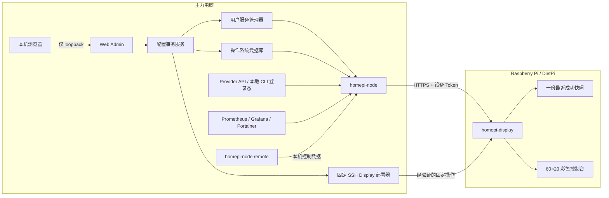

# HomePi Monitor

[English](README.md) | [简体中文](README.zh-CN.md)

HomePi Monitor 是一个双节点、自托管的 Raspberry Pi 信息屏项目，用于展示当前 AI Coding Plan 配额和 API 余额。用户级 daemon `homepi-node` 运行在主力电脑上，只读本地受支持的凭据或 Provider API，把当前指标标准化后通过设备级鉴权接口发送出去；独立的只输出程序 `homepi-display` 运行在 Raspberry Pi / DietPi 上，以紧凑的 60×20 彩色控制台界面渲染快照。

项目还提供只监听本机 loopback 的 Web Admin，可管理 Provider 和部署经验证的 Display 配置；同时支持五页 Provider/HomeLab 轮播，以及通过本机管理员 CLI 发布允许列表内的远程显示命令。

> [!IMPORTANT]
> HomePi Monitor 仍在持续开发。Phase 1 至 Phase 4 的代码与自动化门禁已经实现；Windows/Linux node 原生生命周期、真实账号/Provider 对账、真实 HomeLab 服务故障矩阵和最终物理屏肉眼检查仍是明确保留的手动验收项。权威状态见[开发计划](.vibe/Development-Plan.md)。

## 目录

- [为什么使用 HomePi Monitor](#为什么使用-homepi-monitor)
- [功能](#功能)
- [架构](#架构)
- [支持的 Provider](#支持的-provider)
- [环境要求](#环境要求)
- [使用 Mock 数据快速启动](#使用-mock-数据快速启动)
- [安装](#安装)
- [首次配置](#首次配置)
- [Web Admin](#web-admin)
- [通过 CLI 管理 Provider](#通过-cli-管理-provider)
- [以用户服务运行 `homepi-node`](#以用户服务运行-homepi-node)
- [配对并安装 Raspberry Pi Display](#配对并安装-raspberry-pi-display)
- [远程控制 Display](#远程控制-display)
- [配置与数据位置](#配置与数据位置)
- [开发](#开发)
- [构建与发布](#构建与发布)
- [安全模型](#安全模型)
- [故障排查](#故障排查)
- [项目规格](#项目规格)

## 为什么使用 HomePi Monitor

- Provider Key 和本地 CLI 登录态保留在主力电脑上，不下发到物理暴露的 Pi。
- 只展示当前运行状态，不维护历史指标数据库。
- node 或网络临时中断时，继续显示一份最近成功快照。
- 使用适合 480×320 屏幕和 60×20 终端的确定性小型控制台渲染器。
- 通过本机浏览器配置 Provider，同时不把管理面暴露到 LAN。
- 使用两个自包含 Go binary，不依赖浏览器运行时、CDN、外部字体或 Node.js。

## 功能

- 支持 macOS、Linux 和 Windows 用户会话的跨平台 `homepi-node` daemon。
- Raspberry Pi ARMv7 kiosk，使用亮青色边框和青/黄色配额进度条。
- 默认使用丰富的 Unicode 线框字符，并提供逐字节安全的纯 ASCII 降级。
- 标准化当前配额、余额、新鲜度、精度、Provider 健康状态和重置时间。
- 通过鉴权快照和 WebSocket 流服务一个或多个明确配对的 Display 设备。
- 自动生成自签名 TLS 证书，并由 Display 固定证书指纹。
- 操作系统凭据存储：macOS Keychain、Windows Credential Manager、Linux Secret Service；不可用时显式告警并降级为 `0600` 文件。
- loopback-only Web Admin：Provider 草稿、只读测试、差异审查、显式 Apply、失败回滚、CSRF/Origin/Host 防护和服务版本漂移提示。
- 固定操作的 SSH Display 部署：候选校验、原子替换、重启健康确认和失败回滚。
- 五个可配置轮播页面，以及有界的 Prometheus、Grafana、Portainer 当前状态摘要。
- 通过既有 Display 出站流执行允许列表内的远程切页、轮播、刷新、消息和可选亮度命令。
- 用户级服务集成：LaunchAgent、`systemd --user` 或 Windows Scheduled Task。
- 可复现本机构建和 12 个产物的发布矩阵。

### 当前交付状态

| 范围 | 状态 | 说明 |
|---|---|---|
| Node 采集、协议、TLS、设备 ACL | 已实现 | Windows/Linux 原生生命周期验证仍是明确保留的验收项。 |
| Provider 连接器 | 已实现 | 投入实际使用前，仍应把真实账号数值与 Provider 控制台对账。 |
| Raspberry Pi 控制台 kiosk | 已实现 | 支持 `rich`/`ascii` 主题和一份最近成功快照。 |
| Provider Web Admin | 已实现，等待手动验收 | 只监听 loopback；编辑 Provider，并把验证后的事务应用到已安装 node 服务。 |
| 经 SSH 配置 Display | 已实现，等待手动验收 | Web Admin 使用固定 SSH 操作，校验候选、重启固定 unit、确认健康，并在失败时回滚。 |
| HomeLab 页面与轮播 | 已实现，等待手动验收 | 真实 Prometheus/Grafana/Portainer 服务故障验证仍需要用户提供端点和只读凭据。 |
| 远程显示控制 | 已实现，等待手动验收 | 本机管理员 CLI、有界队列/审计、WebSocket ACK、持久幂等和 60×20 消息渲染已有自动化覆盖。 |

## 架构



Pi 永远不会收到 Provider Key、`auth.json`、Cookie、Authorization Header 或 Provider 原始响应；它只接收标准化且限定到本设备的展示数据。

## 支持的 Provider

| Provider 类型 | 界面名称 | 凭据来源 | 数据路径 |
|---|---|---|---|
| `codex_usage` | Codex (wham/usage) | 只读既有 Codex CLI `auth.json` | 兼容性用量端点 |
| `grok_usage` | Grok Usage | 只读官方 Grok CLI `auth.json` | CLI billing credits 端点返回的消费订阅每周共享用量池 |
| `minimax_coding` | MiniMax Coding Plan | MiniMax API / Subscription Key | Token Plan，带一次有界旧路径回退 |
| `kimi_coding` | Kimi Coding Plan | Kimi Coding API Key | 兼容性 Coding Plan 端点 |
| `deepseek_api` | DeepSeek API | DeepSeek API Key | 官方余额端点 |
| `kimi_api` | Kimi (Moonshot) API | Moonshot API Key | 官方余额端点 |
| `mock` | Mock Fixture | 不需要凭据 | 本地 JSON fixture |
| `prometheus` | Prometheus | 可选只读 bearer token | 有界 instant query 模板 |
| `grafana` | Grafana | 只读 service-account token | 健康与告警规则摘要 |
| `portainer` | Portainer | 只读 API Key | 状态、环境、stack 与容器摘要 |

HomePi 不会为任何 Provider 执行登录、登出、Token 刷新或账号切换。登录生命周期完全由对应 Provider 的官方 CLI 或控制台负责。既有登录失效时，HomePi 只报告认证问题，并等待操作者通过官方工具修复。

## 环境要求

### 主力电脑

- [`go.mod`](go.mod) 声明的 Go `1.26.5` 或更高版本。
- Git，用于源码获取和构建元数据。
- macOS、Linux 或 Windows，用于运行 `homepi-node`。
- macOS/Linux 的仓库脚本需要 GNU Make 和 Bash。
- Web Admin 需要桌面浏览器。
- 建议提供可访问的操作系统 Keyring；无桌面的 Linux 可以使用带告警的 `0600` 文件降级。

### Raspberry Pi Display

- Raspberry Pi 3 Model B+，或发布矩阵支持的其他 Linux 目标。
- 使用 `systemd` 的 DietPi/Debian，用于文档中的 kiosk unit。
- 至少 60 列 × 20 行的控制台。
- Pi 能访问 node 的 HTTPS 监听地址。
- 安装和维护需要 SSH；正常运行时不依赖 SSH。

### 平台说明

- Make/shell 自动化面向 macOS 和 Linux。
- Windows binary 和 Scheduled Task 集成已经实现，但仓库暂时没有 Windows 原生安装脚本。
- 发布矩阵为 `darwin/amd64`、`darwin/arm64`、`windows/amd64`、`linux/amd64`、`linux/arm64` 和 `linux/arm/v7`。

## 使用 Mock 数据快速启动

该路径在本机运行两个程序，使用仓库内 fixture，只在 loopback 上禁用 TLS，不修改正常配置或凭据库。

```bash
git clone <repository-url>
cd homepi-mon

go mod download
make build
```

在第一个终端启动 mock node：

```bash
make run-node
```

在第二个终端启动 Display：

```bash
make run-display
```

Display 会进入终端备用屏幕；按 `Ctrl-C` 停止并恢复原终端。如需覆盖开发 Token，两个命令必须使用相同值：

```bash
export HOMEPI_DEVICE_TOKEN='replace-with-a-local-development-token'
make run-node
# 在第二个终端执行 make run-display 前导出同一个值。
```

`-no-tls` 被刻意限制在 loopback；真实 LAN 部署必须使用 HTTPS 和证书指纹固定。

## 安装

### 1. 在 macOS 或 Linux 从源码构建

```bash
go mod download
make check
make build VERSION=0.1.0

./bin/homepi-node --version
./bin/homepi-display --version
```

binary 会写入 `bin/`。它们是开发产物，执行 `make clean` 会删除。

### 2. 在 macOS 或 Linux 安装持久的本地 binary

先预览操作：

```bash
VERSION=0.1.0 ./scripts/install-local.sh --dry-run
```

把两个 binary 安装到 `$HOME/.local/bin`：

```bash
make install-local VERSION=0.1.0
export PATH="$HOME/.local/bin:$PATH"

homepi-node --version
homepi-display --version
```

安装器会验证两个 binary、原子替换目标，并保留一份 `.previous`。如果已有 `homepi-node` 用户服务在安装前处于 installed/running 状态，安装器会重启并检查服务；否则只更换 binary。

安装器支持以下参数：

```text
scripts/install-local.sh [--install-dir PATH] [--skip-build] [--no-restart] [--dry-run]
```

`make install-local` 是 binary 安装器，**不会**首次注册用户服务。创建有效配置后，需要另行执行 `homepi-node install`。

### 3. 在 Windows 构建

在已安装 Go 的普通 PowerShell 会话中执行：

```powershell
go mod download
New-Item -ItemType Directory -Force bin | Out-Null
go build -trimpath -o bin/homepi-node.exe ./cmd/homepi-node
go build -trimpath -o bin/homepi-display.exe ./cmd/homepi-display
.\bin\homepi-node.exe --version
```

注册 Scheduled Task 前，应把 `homepi-node.exe` 复制到不会随源码目录被清理的、当前用户拥有的持久目录。

## 首次配置

### 1. 创建配置文件

```bash
homepi-node config init
homepi-node config show
homepi-node config validate
homepi-node doctor
```

生成的配置包含一个 source node、一个 loopback HTTPS listener，不包含设备和 Provider。`config init` 会拒绝覆盖已有文件。

默认配置位置遵循操作系统约定：

| 平台 | 默认路径 |
|---|---|
| macOS | `~/Library/Application Support/homepi-node/config.json` |
| Linux | `$XDG_CONFIG_HOME/homepi-node/config.json`；未设置时为 `~/.config/homepi-node/config.json` |
| Windows | `%AppData%\homepi-node\config.json` |

可通过 `HOMEPI_NODE_CONFIG` 使用其他配置文件。支持配置路径的子命令也可以显式传入 `-config`。

### 2. 选择 node 监听地址

初始配置绑定 `127.0.0.1:8443`，适合本地配置，但 Pi 无法访问。真实 LAN 部署时，把 `listen.addr` 改为主机稳定的私网地址或 LAN 接口，并保留自动 TLS：

```json
{
  "schema_version": 1,
  "source_node": {
    "id": "dev-mac",
    "label": "DEV-MAC"
  },
  "listen": {
    "addr": "192.168.1.20:8443",
    "tls": {
      "cert": "auto",
      "key": "auto"
    }
  },
  "devices": [],
  "providers": []
}
```

编辑完整文件时应保留已有的 `schema_version`、`devices` 和 `providers`。每次手工修改后都要验证：

```bash
homepi-node config validate
```

绑定公网接口需要显式设置 `allow_public_bind`。建议使用私有 LAN、Tailscale 或 WireGuard，不要把 node 匿名暴露在 Internet 上。

### 3. 安装用户服务

从持久安装的 binary 执行：

```bash
homepi-node install
homepi-node status
```

服务以当前用户身份注册，不需要 root/SYSTEM 权限。macOS 和 Linux 会在安装时启动；任一平台上的 `status` 如果显示服务未运行，再执行 `homepi-node start`。

## Web Admin

Web Admin 是推荐的 Provider 管理入口。它只监听 `127.0.0.1` 或 `::1`，默认选择随机端口，并在连续一小时没有 HTTP 请求后关闭。

```bash
homepi-node configure
```

如需固定端口或不自动打开浏览器：

```bash
homepi-node configure \
  -addr 127.0.0.1:8765 \
  -idle-timeout 30m \
  -no-browser
```

典型流程：

1. 打开 **Providers**，创建或编辑 Provider 草稿。
2. 需要 Key 时，只在密码输入框中输入。
3. 对新增或凭据变化且启用的 Provider 执行只读 **Test**。
4. 审查脱敏差异。
5. 选择 **Apply changes**，提交版本化秘密引用、保存配置、重启已安装服务并执行健康检查。

Apply 失败时，事务会恢复之前的配置和秘密集合。页面不会把秘密值返回浏览器，也不会把秘密保存到浏览器持久存储。

页面顶部还会比较当前 Web Admin binary 与用户服务登记的 binary。如果出现版本或来源不一致提示，应先安装当前 binary，再 Apply 新 Provider 类型：

```bash
make install-local VERSION=0.1.0
homepi-node status
```

> [!WARNING]
> Apply 会真实重启当前用户的 `homepi-node` 服务。隔离查看界面时可使用 [`scripts/smoke-webadmin.sh`](scripts/smoke-webadmin.sh)，除非确实要更新已配置服务，否则不要点击 Apply。

## 通过 CLI 管理 Provider

CLI 与 Web Admin 共用同一个配置事务核心，适合自动化和故障恢复。

列出并测试 Provider：

```bash
homepi-node provider list
homepi-node provider test -id codex-main
```

使用官方 CLI 既有的默认 `auth.json` 添加 Codex Usage：

```bash
homepi-node provider add \
  -id codex-main \
  -type codex_usage \
  -account-label main \
  -region global \
  -interval 5m \
  -stale-after 15m
```

使用官方 Grok CLI 默认认证态添加消费订阅每周用量：

```bash
homepi-node provider add \
  -id grok-main \
  -type grok_usage \
  -account-label main \
  -region global \
  -interval 5m \
  -stale-after 15m
```

连接器只读 `~/.grok/auth.json`，主动请求官方 CLI 使用的 billing credits 端点。响应包含 `creditUsagePercent` 时显示每周剩余百分比；Unified Billing 省略该字段且 weekly 周期覆盖采集时刻时，HomePi 按官方 CLI 的零用量语义显示 100% 剩余与真实重置时间。显式 `null` 仍显示 `N/A`；省略百分比且周期已过期或尚未开始时返回 schema 错误。连接器不会启动 Grok、刷新 Token 或修改认证文件。只有官方 CLI 使用其他本地路径时才需要通过 `-auth-file` 指定路径；也可以使用经过校验的 `custom` 区域兼容代理。

添加需要 API Key 的 Provider，同时避免把 Key 放入 argv 或 Shell 历史：

```bash
read -r -s PROVIDER_KEY
printf '\n'
printf '%s' "$PROVIDER_KEY" | homepi-node provider add \
  -id minimax-main \
  -type minimax_coding \
  -account-label main \
  -region global \
  -interval 5m \
  -stale-after 15m \
  -secret-stdin
unset PROVIDER_KEY
```

添加仓库自带的 Mock fixture：

```bash
homepi-node provider add \
  -id phase1-mock \
  -type mock \
  -account-label demo \
  -interval 5s \
  -stale-after 5m \
  -mock-fixture "$PWD/examples/mock-fixture.json"
```

编辑、停用或删除 Provider：

```bash
homepi-node provider edit -id minimax-main -interval 10m
homepi-node provider edit -id minimax-main -enabled=false
homepi-node provider remove -id minimax-main
```

CLI Provider 写操作会保存配置，但不会自动重启服务。CLI 改动后应显式重载：

```bash
homepi-node stop
homepi-node start
homepi-node status
```

## 以用户服务运行 `homepi-node`

所有支持的 node 平台使用相同生命周期命令：

```bash
homepi-node install
homepi-node start
homepi-node stop
homepi-node status
homepi-node uninstall
```

各平台实现：

| 平台 | 用户级服务 |
|---|---|
| macOS | `~/Library/LaunchAgents/com.galendai.homepi-node.plist` |
| Linux | `~/.config/systemd/user/homepi-node.service` |
| Windows | 名为 `HomePi Monitor` 的 Scheduled Task |

前台运行 daemon 进行诊断：

```bash
homepi-node serve -verbose
```

常用健康和诊断命令：

```bash
homepi-node config validate
homepi-node doctor
homepi-node status
```

`doctor` 输出脱敏的构建、配置、秘密后端、证书指纹、撤销状态和 Provider 摘要，不会输出 Provider Key 或设备 Token。

## 配对并安装 Raspberry Pi Display

初次安装 binary/unit 后，Web Admin 可通过固定 SSH 事务部署已配对 Display。以下步骤仍是受支持的手工安装与恢复路径。

### 1. 在 node 主机配对设备

```bash
homepi-node device add -id pi-kiosk
homepi-node device list
homepi-node doctor
```

`device add` 只显示一次明文设备 Token，应把它安全地保存到 Pi 环境文件。node 使用自动 TLS 启动后，再复制 `doctor` 输出的 SHA-256 证书指纹。

以后撤销 Display：

```bash
homepi-node device revoke -id pi-kiosk
```

### 2. 构建 ARMv7 Display 产物

```bash
make dist VERSION=0.1.0
make verify-release VERSION=0.1.0
```

Raspberry Pi 3 产物为 `dist/homepi-display-0.1.0-linux-armv7`。

### 3. 复制 binary 到 Pi

如果环境使用其他主机名，请替换 SSH alias：

```bash
scp dist/homepi-display-0.1.0-linux-armv7 dietpi:/tmp/homepi-display
ssh dietpi
```

在 Pi 上执行：

```bash
sudo install -m 0755 /tmp/homepi-display /usr/local/bin/homepi-display
sudo useradd --system --user-group --home-dir /var/lib/homepi-display \
  --create-home --shell /usr/sbin/nologin homepi-display
sudo install -d -o homepi-display -g homepi-display -m 0750 /var/lib/homepi-display
sudo install -d -m 0755 /etc/homepi-display

/usr/local/bin/homepi-display service-unit | \
  sudo tee /etc/systemd/system/homepi-display.service >/dev/null
/usr/local/bin/homepi-display environment-example | \
  sudo tee /etc/homepi-display/environment >/dev/null
sudo chmod 0600 /etc/homepi-display/environment
sudoedit /etc/homepi-display/environment
```

如果 `homepi-display` 用户已经存在，应跳过 `useradd`，并在继续前确认它的 home、group 和目录所有权。填写以下字段：

- `HOMEPI_NODE_URL`：Pi 可访问的 node HTTPS URL。
- `HOMEPI_DEVICE_ID`：`pi-kiosk` 或上面创建的 ID。
- `HOMEPI_SOURCE_NODE_ID`：node 配置中完全一致的 `source_node.id`。
- `HOMEPI_NODE_CERT_PIN`：`homepi-node doctor` 输出的指纹。
- `HOMEPI_DEVICE_TOKEN`：`device add` 一次性输出的 Token。
- `HOMEPI_DISPLAY_STYLE`：`rich` 或 `ascii`。

启用 kiosk：

```bash
sudo systemctl daemon-reload
sudo systemctl enable --now homepi-display.service
sudo systemctl status homepi-display.service
journalctl -u homepi-display.service -n 100 --no-pager
```

仓库提供的 unit 把程序绑定到 `tty1`、关闭 stdin、失败后自动重启，并把可写范围限制在 `/var/lib/homepi-display`。

### 4. 手工运行 Display

前台诊断示例：

```bash
export HOMEPI_NODE_URL='https://192.168.1.20:8443'
export HOMEPI_DEVICE_ID='pi-kiosk'
export HOMEPI_SOURCE_NODE_ID='dev-mac'
export HOMEPI_NODE_CERT_PIN='sha256:replace-with-doctor-fingerprint'
export HOMEPI_DEVICE_TOKEN='replace-with-device-token'
export HOMEPI_DISPLAY_STYLE='rich'

homepi-display run -verbose
```

可用 `homepi-display doctor -node-id dev-mac` 检查本地快照，命令不会输出 Token。

## 远程控制 Display

Phase 4 命令只能在 node 主机本机通过 `homepi-node remote` 发布。CLI 使用 node secret store 中的独立控制凭据鉴权，不复用、也不显示 Display 设备 Token。命令沿 Display 已有的出站鉴权 WebSocket 传输，因此 Pi 不会新增控制端口。

示例：

```bash
# 临时显示 API 30 秒，然后恢复此前轮播位置。
homepi-node remote --device pi-kiosk show-page --duration 30s API

# 相对当前页前后切页，不修改持久页面顺序。
homepi-node remote --device pi-kiosk next-page --duration 20s
homepi-node remote --device pi-kiosk previous-page --duration 20s

# 临时停止轮播，或以 10 秒间隔轮播全部页面。
homepi-node remote --device pi-kiosk set-rotation --duration 2m off
homepi-node remote --device pi-kiosk set-rotation --interval 10s --duration 2m on

# 对全部启用连接器或指定 ID 触发一次有界采集。
homepi-node remote --device pi-kiosk refresh
homepi-node remote --device pi-kiosk refresh prometheus-main grafana-main

# 显示安全的三行消息；文本必须是可打印 ASCII。
homepi-node remote --device pi-kiosk show-message \
  --severity warning --duration 30s 'MAINTENANCE STARTS SOON'
```

仅配置一个 Display 时可省略 `--device`。CLI 默认等待最终 `executed`、`rejected`、`expired` 或 `failed` 结果，并输出结构化 JSON；只有在“命令已入队”已经足够时才使用全局 `--wait=false`。传输 TTL 默认为 30 秒，可通过动作级 `--ttl 5s..5m` 修改。

`set-brightness 0..100` 在允许列表中，但只有 Display 构建配置了受支持的背光驱动时才会成功。标准 DietPi 构建返回 `failed/unsupported_capability`，不会把未发生的亮度变化伪报为成功。

优先级固定为：本地计算的 CRIT 页面 > 远程消息 > 远程页面/轮播覆盖 > 自动轮播。覆盖到期后恢复此前页面和剩余停留时间。远程命令永远不会改写 `/etc/homepi-display/environment`。

### 恢复与回退

- Display 离线时，daemon 只保留有界且未过期的命令；重连后不会下发已过期命令。
- 重复 command ID 不会重复执行 UI 动作；Display 重启后仍由 Pi 上有界的 `0600` 结果记录识别重放。
- Node 队列与 Display 账本通过原子替换保证正常进程/service 重启恢复。为保持低速存储上的亚秒 UI 时延，不会对每条命令强制 file/directory `fsync`；突然断电时不保证最后一条缓冲命令 exactly-once。
- 临时覆盖可等待 duration 到期，或发送一个更短的新覆盖；持久页面顺序和 dwell 仍由 Web Admin Display 事务管理。
- 回退功能构建时，恢复此前保留的 `homepi-node`/`homepi-display` binary，并重启固定服务。旧 Display 会忽略较新的可选 stream 消息，不需要回退 Pi 配置或监听端口。
- 只通过 node/Display 服务日志检查脱敏元数据；消息审计只包含长度和 SHA-256，不包含全文。

## 配置与数据位置

| 数据 | 默认位置 | 覆盖方式 |
|---|---|---|
| Node 配置 | 操作系统用户配置目录 + `homepi-node/config.json` | `HOMEPI_NODE_CONFIG` 或 `-config` |
| Node 运行数据 | 操作系统用户配置目录 + `homepi-node/` | `HOMEPI_NODE_DATA_DIR` |
| 秘密文件降级目录 | Node 数据目录 + `secrets/` | `HOMEPI_SECRET_DIR` |
| 配置事务数据 | Node 数据目录 | `HOMEPI_DATA_DIR` |
| Display 快照 | 操作系统用户配置目录 + `homepi-display/` | `HOMEPI_DISPLAY_DATA_DIR` 或 `-data-dir` |
| Node 命令队列/结果审计 | Node 运行数据目录 + `commands.json` | `HOMEPI_NODE_DATA_DIR` |
| Display 命令幂等记录 | Display 数据目录 + `command-results.json` | `HOMEPI_DISPLAY_DATA_DIR` 或 `-data-dir` |

Node 数据目录包含生成的 TLS 材料、撤销列表、以服务安装时的日志，以及无法使用 OS Keyring 时的秘密降级文件。不要提交或分享该目录。

## 开发

### 仓库结构

```text
cmd/homepi-node/           daemon、CLI、服务和 Web Admin 入口
cmd/homepi-display/        kiosk 运行时与终端生命周期
internal/configtx/         共享 Provider/配置事务服务
internal/commandbus/       daemon 有界命令队列与结果审计
internal/connector/        Provider 适配器与公共 HTTP 策略
internal/nodeapi/          鉴权快照与事件流 API
internal/protocol/         Wire 与指标契约
internal/remotecontrol/    Display 校验、幂等与 UI 动作
internal/ui/               确定性 60×20 renderer 和 golden 文件
internal/webadmin/         内嵌 loopback Web Admin 与静态资源
internal/install/          各平台用户服务集成
internal/kioskunit/        经审计的 DietPi systemd 模板
examples/                  Mock fixture
scripts/                   构建、检查、发布和安装自动化
.vibe/                     产品、架构、模块和测试规格
```

### 规格优先工作流

修改行为前：

1. 阅读 [PRD](.vibe/PRD.md)、[高层规格](.vibe/HL-Spec.md)以及对应的模块/测试规格。
2. 在实现前更新规格和测试用例。
3. 只进行解决当前问题所需的最小范围代码修改。
4. 先执行针对性测试，再执行完整质量门禁。
5. 把实际结果写回对应的 `.vibe/Test-Module-*.md`。
6. Git commit 前请求用户检查。

代码注释和 Commit Message 使用英文；`.vibe/` 下的项目设计、开发和测试规格使用简体中文。

### 常用开发命令

| 命令 | 用途 |
|---|---|
| `make check` | 检查格式，执行 `go vet ./...` 和 `go test ./...`。 |
| `make test` | 执行全部 Go 测试。 |
| `make vet` | 执行 Go 静态分析。 |
| `make fmt` | 使用 `gofmt` 重写 Go 文件，执行后应审查 diff。 |
| `make build` | 为当前平台构建两个 binary 到 `bin/`。 |
| `make golden` | 重新生成 60×20 UI golden 文件，必须人工检查视觉 diff。 |
| `make dist` | 交叉构建六平台发布矩阵。 |
| `make verify-release` | 构建、生成校验和并验证恰好 12 个发布产物。 |
| `make install-local` | 原子安装当前平台 binary 到用户目录。 |
| `make clean` | 删除仓库中的 `bin/` 和 `dist/` 产物。 |

需要时直接执行针对性或 race 测试：

```bash
go test ./internal/webadmin ./internal/configtx -count=1
go test -race ./cmd/homepi-node ./internal/webadmin ./internal/configtx -count=1
go test ./internal/ui -count=1
```

使用非默认端口检查内嵌 Web Admin：

```bash
HOMEPI_WEBADMIN_ADDR=127.0.0.1:18765 \
  ./scripts/smoke-webadmin.sh -idle-timeout 10m
```

Smoke 进程本身是临时的，但 Apply 仍会操作当前用户的真实服务管理器，应把 Apply 视为状态变更操作。

### 依赖与格式检查

```bash
go mod verify
gofmt -l cmd internal
go vet ./...
go test ./...
git diff --check
```

测试结束后必须清理临时 fixture、证书、脚本和运行数据。

## 构建与发布

向本地 binary 注入发布版本：

```bash
make build VERSION=1.2.3
./bin/homepi-node --version
```

构建并验证完整发布矩阵：

```bash
make dist VERSION=1.2.3
make verify-release VERSION=1.2.3
```

发布验证器要求六个目标各有两个 binary，总计恰好 12 个产物，并生成 `dist/SHA256SUMS`。同版本出现额外产物时会直接失败，不会静默把它加入发布。

发布自动化可显式设置构建元数据以获得确定性结果：

```bash
VERSION=1.2.3 \
COMMIT=abc1234 \
BUILD_DATE=2026-08-12T00:00:00Z \
./scripts/build.sh
```

## 安全模型

- `homepi-node` 必须以登录用户运行，不能使用 root 或 SYSTEM。
- Provider 凭据只保留在 node 主机；Pi 只接收标准化展示指标。
- 不要通过 argv 传递 Provider Key；使用 Web Admin 密码框、`-secret-stdin` 或受控环境变量。
- 不要提交 Node 数据目录、生成证书、带本地信息的配置变体、环境文件或设备 Token。
- `/etc/homepi-display/environment` 必须使用正确所有者并保持 `0600`。
- 真实 LAN Display 使用 HTTPS 和 `homepi-node doctor` 提供的证书指纹。
- loopback Web Admin 不是 LAN 或公网管理 API，不要把它放在公网反向代理后面。
- 自定义 Provider URL 会阻止私网/link-local metadata 目标，但操作者仍应只使用可信 HTTPS 端点。
- Codex `auth.json` 只读打开，不跟随符号链接，也不会被 HomePi 刷新或修改。
- Grok 本地 `auth.json` 只读打开，不跟随符号链接，也不会发送到 Pi；HomePi 不登录、不刷新、不写回认证文件，只向官方 CLI 使用的兼容性 billing 端点发起只读请求。
- 撤销设备会删除配置和已存凭据，并持久化 Token 哈希，使泄漏的旧 Token 继续被拒绝。
- 远程命令发布使用独立的本机控制凭据；Display Token 不能发令，浏览器 Origin 被拒绝，Pi 不新增入站监听。
- 远程命令状态有界且 mode 为 `0600`；完成后的消息只保留长度与 SHA-256 元数据。

规范性契约见 [HL-Spec 安全规格](.vibe/HL-Spec.md#10-安全规格)。

## 故障排查

### `no -config file and no -device-id; nothing to serve`

先创建正常配置：

```bash
homepi-node config init
homepi-node config validate
```

`-device-id`/`-mock-fixture` 是兼容旧 Mock 开发流程的参数，不是推荐的生产配置方式。

### Web Admin 提示服务版本不同

浏览器由一个 `homepi-node` binary 启动，而服务管理器指向另一个 binary。安装当前版本并检查状态：

```bash
make install-local VERSION=0.1.0
homepi-node status
```

不要假设 Apply 会升级服务 binary；Apply 只会重启服务管理器已经登记的 binary。

### Web Admin Apply 提示服务未安装

使用持久 binary，验证配置，再注册用户服务：

```bash
homepi-node config validate
homepi-node install
homepi-node status
```

### Provider needs attention

```bash
homepi-node provider list
homepi-node provider test -id <provider-id>
homepi-node doctor
```

- `codex_usage` 必须通过官方 Codex CLI 修复登录；HomePi 不刷新登录态。
- `grok_usage` 如需修复登录，应运行官方 Grok CLI；HomePi 不执行登录、刷新或修改 `auth.json`。
- Grok Unified Billing 在当前有效 weekly 周期内省略百分比字段时，按官方 CLI 的零用量语义显示 100% 剩余。显式 `null` 仍显示 `N/A`；已过期或尚未开始的周期不适用零用量兼容。
- API Provider 应在 Web Admin 重新输入 Key，并在 Apply 前执行只读 Test。
- Schema 错误可能表示上游响应发生变化；提交问题时只能保留脱敏样本。
- 遵守 Provider rate limit，不要把采集周期设为低于表单规定的最小值。

### Pi 显示旧数据或无法连接

按顺序检查：

1. Node 主机上的 `homepi-node status` 和 `homepi-node doctor`。
2. Pi 的 `HOMEPI_NODE_URL`、source node ID、device ID、Token 和证书指纹。
3. LAN 防火墙是否允许访问 node 配置的 HTTPS 端口。
4. Pi 上的 `journalctl -u homepi-display.service -n 100 --no-pager`。
5. 使用 `homepi-display doctor -node-id <source-node-id>` 检查缓存快照。

不要用 `-no-tls` 绕过 LAN TLS 问题；该参数会按设计拒绝非 loopback HTTP。

### 秘密存储显示 `file-fallback`

HomePi 无法打开原生 Keyring，改为在秘密目录写入独立的 `0600` 文件。桌面 Linux 应确保 Secret Service 会话可用；无桌面 node 应严格保护目录、备份和用户账号。`homepi-node doctor` 会报告后端类型，但不会输出秘密值。

### 终端尺寸不足

kiosk 需要 60×20 控制台。调整 Linux console 字体、屏幕旋转或 framebuffer 配置。当前字体缺少丰富线框/块字符时，使用 `HOMEPI_DISPLAY_STYLE=ascii`。

## 项目规格

`.vibe` 目录是范围和验收的事实来源：

- [产品需求](.vibe/PRD.md)
- [高层规格](.vibe/HL-Spec.md)
- [开发计划](.vibe/Development-Plan.md)
- [Node 数据采集规格](.vibe/Module-Spec-001-NodeDataCollection.md)
- [TUI Dashboard 规格](.vibe/Module-Spec-002-TUIDashboard.md)
- [Web Admin 规格](.vibe/Module-Spec-005-WebAdmin.md)
- [构建自动化规格](.vibe/Module-Spec-006-BuildAutomation.md)
- [项目文档规格](.vibe/Module-Spec-007-ProjectDocumentation.md)
- [ASCII / Console UI 规格](.vibe/UI-Spec-001-ASCII-Design.md)

当 README 与已认证规格不一致时，以规格和实际可执行行为为准，并提交文档修复。
